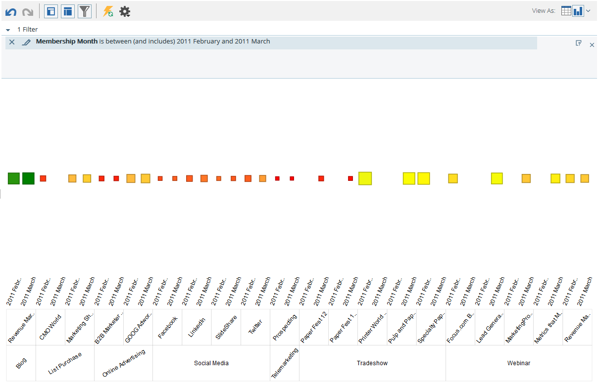

# Graphique Des Résultats À Partir De L’Explorateur De Recettes {#graphing-results-from-revenue-explorer}

Par défaut, les rapports dans l’Explorateur de recettes s’affichent sous forme de tableau. Vous avez également la possibilité d’afficher les résultats sous forme de graphique dans divers formats.

1. Cliquez sur la flèche dans le **Afficher sous** menu déroulant de votre rapport. Différentes options de représentation s’affichent.

   

## Exemples de graphiques {#graph-examples}

**Colonne**: Chaque ligne et chaque colonne du tableau s’affichent sous la forme d’une colonne verticale.

**Colonne empilée**: Chaque ligne du tableau comporte une colonne dans le graphique.

**Colonne empilée à 100 %**: Chaque ligne du tableau comporte une colonne dans le graphique et est mise à l’échelle à 100 %.

**Ligne**: Chaque colonne est affichée sous forme de ligne et chaque ligne sous la forme d’un point de données sur la ligne.

**Combo ligne de colonne**: Combinaison de graphiques en colonnes et en lignes.

**Barre**: Chaque ligne et chaque colonne du tableau s’affichent sous la forme d’une barre horizontale.

**Barre empilée**: Chaque ligne du tableau comporte une ligne dans le graphique.

**Barre empilée à 100 %**: Chaque ligne du tableau comporte une ligne dans le graphique et est mise à l’échelle à 100 %.

**Zone**: Les données s’affichent comme une barre empilée, mais sont remplies.

**Diagramme**: Chaque colonne est présentée sous forme de graphique en secteurs, chaque ligne sous la forme d’une tranche.

**Rayon**: Graphique radial qui représente les attributs en tranches.

**Diagramme**: Bulles basées sur les attributs utilisés. Utilisez des mesures pour coder par couleur la bulle et/ou déterminer sa taille.

**Grille de chaleur**: Personnalisez les couleurs et les formes pour identifier les modèles de performances positifs et négatifs.

1. Pour revenir en mode Tableau, cliquez sur le bouton Tableau.

   
