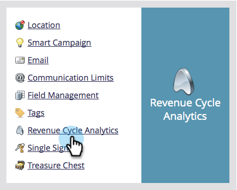

# Synchroniser les champs personnalisés avec l’explorateur de recettes {#sync-custom-fields-to-the-revenue-explorer}

Revenue Cycle Analytics peut créer des rapports sur les champs Marketo personnalisés. Pour ce faire, vous devez définir les champs personnalisés à synchroniser.

>[!NOTE]
>
>**Autorisations d’administrateur requises**

1. Accédez à la section **Admin** .

   

1. Sélectionnez **Revenue Cycle Analytics**.

   

1. Cliquez sur l’onglet **Synchronisation de champ personnalisé** et sélectionnez la zone d’analyse de votre choix.

   

1. Sélectionnez le champ pour lequel vous souhaitez activer la synchronisation et cliquez sur **Modifier l’option de synchronisation**.

   

1. Remplacez le **État de synchronisation** par **Activé**.

   

1. Sélectionnez le **type RCA** de votre choix, puis cliquez sur **Enregistrer**.

   

   >[!TIP]
   >
   >Une fois activées, les données seront disponibles dans les analyses du cycle de revenu le jour suivant.

   Beau boulot ! Vous savez maintenant comment ajouter des champs personnalisés à RCA.
