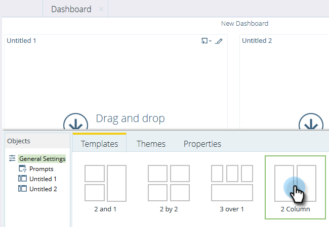

# Utilisation de Tableaux de bord dans l&#39;Explorateur de recettes {#using-dashboards-in-revenue-explorer}

Un tableau de bord est une combinaison de rapports de l&#39;Explorateur de recettes pour obtenir un aperçu rapide de vos pistes, campagnes, opportunités et/ou modèles.

## Création d’un Tableau de bord {#creating-a-new-dashboard}

1. Cliquez sur Explorateur **** de recettes.

   

1. Cliquez sur **Créer**, puis sur **Tableau de bord**.

   

1. Au bas de la page, les modèles sont sélectionnés par défaut. Cliquez sur la mise en page à utiliser. &quot;2 Colonne&quot; est utilisé ici.

   

   >[!NOTE]
   >
   >Vous pouvez personnaliser davantage l’aspect de votre tableau de bord en cliquant sur **Thèmes** et en choisissant votre favori.

1. Dans la première section de votre tableau de bord, cliquez sur l’icône **Insérer** et sélectionnez **Fichier**.

   

1. Doublon-clic sur **Explorateur** de recettes.

   

1. Doublon-clic sur **Tous les rapports et Tableaux de bord**.

   

1. Cliquez avec le doublon sur le dossier contenant le rapport que vous souhaitez utiliser.

   

1. Choisissez votre rapport, puis cliquez sur **Sélectionner**.

   

1. Le rapport est ensuite renseigné. Répétez les étapes 4 à 8 pour chaque section restante.

   

1. Pour renommer une section, cliquez dessus pour la sélectionner, tapez le nom de votre choix sous Titre, puis cliquez sur** Appliquer**. Répétez cette opération pour chaque section.

   

1. Pour enregistrer, cliquez sur l’icône Enregistrer, saisissez un nom de fichier, cliquez sur le dossier de l’Explorateur de recettes en doublon jusqu’à ce que vous accédiez au dossier de votre tableau de bord, puis cliquez sur **Enregistrer**.

   

## Modification d’un Tableau de bord {#editing-a-dashboard}

1. Cliquez sur Explorateur **** de recettes.

   

1. Doublon-cliquez sur le dossier Explorateur **de** recettes. Accédez à l&#39;emplacement de votre tableau de bord.

   

1. Sélectionnez le tableau de bord à modifier, puis cliquez sur **Modifier**.

   

## Suppression d’un Tableau de bord {#deleting-a-dashboard}

1. Cliquez sur Explorateur **** de recettes.

   

1. Doublon-cliquez sur le dossier Explorateur **de** recettes. Accédez à l&#39;emplacement de votre tableau de bord.

   

1. Sélectionnez le tableau de bord à supprimer, puis cliquez sur **Déplacer vers la corbeille**.

   

