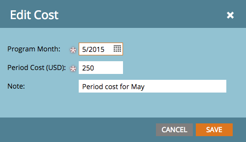

# Définir les coûts de la période {#define-period-costs}

>[!NOTE]
>
>**Définition**
>
>Un coût de période est le montant que vous dépensez sur un programme. Il peut s’agir d’un ou de plusieurs mois et est utilisé pour le RSI du rapports.

Suivez et associez les coûts de prise en charge des pistes et d&#39;acquisition des pistes pour un Programme ou un Événement en définissant quand et où vous souhaitez prendre en charge les coûts des pistes.

>[!NOTE]
>
>Au début d&#39;un Programme, entrez les coûts prévus. Une fois la période du Programme terminée, vous pouvez modifier le coût de la période et saisir le coût réel. Vous obtiendrez ainsi des résultats de rapports précis.

## Définir un coût de période {#define-a-period-cost}

1. Accédez à l&#39;onglet **Configuration** de votre Programme ou Événement.

   

1. Faites glisser **Coût de la période** vers le canevas et la boîte de dialogue **Nouveau coût** s&#39;affiche.

   

1. Entrez le **mois du Programme** que vous souhaitez associer au coût défini.

   

1. Saisissez un **Coût de la période** comme nombre entier sans décimales ou virgules (limite maximale : 999999999)

   

   >[!NOTE]
   >
   >Devise (par exemple USD, EUR, etc.) est un paramètre global géré par un administrateur marketing.

1. Saisissez une description **Note** (facultatif) et cliquez sur **Enregistrer**.

   

## Modifier un coût de période {#edit-a-period-cost}

1. Cliquez avec le bouton droit de la souris sur Coût de la période et sélectionnez **Modifier **dans le menu contextuel pour ouvrir la boîte de dialogue **Modifier le coût**.

   

1. Modifier le coût de la période selon les besoins

   

## Supprimer un coût de période {#delete-a-period-cost}

1. Cliquez avec le bouton droit sur le coût de la période que vous souhaitez supprimer et sélectionnez **Supprimer **dans le menu contextuel pour afficher l&#39;invite **Supprimer le coût **.

   

1. Cliquez sur **Supprimer** pour supprimer définitivement le coût de la période ou sur **Annuler** pour revenir en arrière.

   

