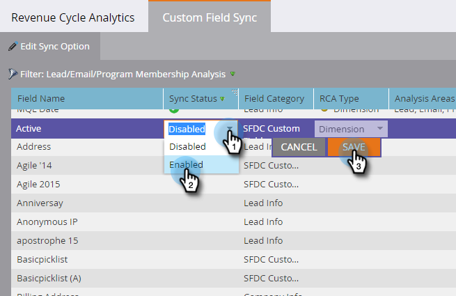

# Activation de la synchronisation des champs personnalisés pour les analyses du cycle de production de recettes {#enabling-custom-field-sync-for-revenue-cycle-analytics}

Les étapes suivantes vous permettent d’utiliser des champs personnalisés dans les rapports RCA.

1. Cliquez sur **Admin**.

   

1. Cliquez sur Analyses **du cycle de** recettes, puis sur Synchronisation **des champs** personnalisés.

   

1. Sélectionnez votre nom **de** champ, puis cliquez sur **Modifier l’option** de synchronisation.

   

1. Sous Etat de synchronisation, sélectionnez **Activé**, puis cliquez sur **Enregistrer**.

   

1. La coche verte vous indique que le champ est configuré pour la synchronisation.

   

   Et c&#39;est ça !

   >[!NOTE]
   >
   >Une fois le champ activé, les données seront disponibles dans les analyses du cycle des recettes le lendemain.

