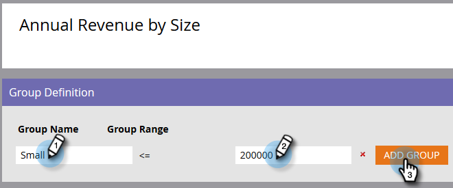
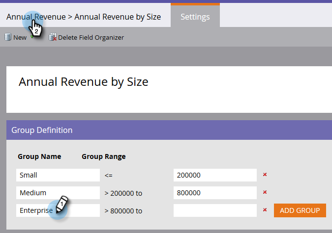

# Création de groupes de champs personnalisés à l’aide de l’organiseur de champs {#create-custom-field-groups-using-the-field-organizer}

Avant de pouvoir activer des groupes de champs personnalisés pour le rapports dans la zone Analyse de performances du modèle de l&#39;Explorateur de cycles de recettes, vous devez classer les champs standard ou personnalisés en groupes pour le rapports via l&#39;organiseur de champs de la gestion des pistes de marketing. Cela ne s&#39;applique qu&#39;aux attributs de piste et de société.
Lorsque vous sélectionnez un champ standard ou personnalisé dans la liste déroulante Champ de la boîte de dialogue Nouvelle organiseur de champs, le système mappe le type de données Gestion des pistes marketing associé au champ que vous souhaitez regrouper avec l&#39;un des trois éditeurs disponibles dans l&#39;organiseur de champs : chaîne, entier ou date.

| Type de données de gestion des pistes marketing | Type de données de l’éditeur de l’organiseur de champs |
|---|---|
| Chaîne | Chaîne |
| Courriel | Chaîne |
| Entier | Entier |
| Texte | Chaîne |
| URL | Chaîne |
| Référence | Non pris en charge |
| Devise | Entier |
| DateTime | Date |
| Boolean | Non pris en charge |
| Téléphone | Chaîne |
| Date | Date |
| Flottant | Entier |
| Calculé | Non pris en charge |

Les trois sections suivantes décrivent comment créer un groupe de champs personnalisé pour un type de chaîne, d’entier ou de date.

## Créer un groupe de champs personnalisé - Éditeur de chaînes {#create-custom-field-group-string-editor}

1. Cliquez sur **Base de données** de pistes.

   

1. Cliquez sur **Nouveau**, puis sélectionnez **Nouveau Gestionnaire de champs**.

   

1. Cliquez sur **Champ** et sélectionnez un champ standard ou personnalisé avec un type de données qui correspond à l’éditeur de chaînes (voir le tableau de la section précédente). Le pays est utilisé ici.

   

1. Cliquez sur **Créer**.

   

   Le nouveau groupe personnalisé s&#39;affiche dans l&#39;arborescence Base de données de pistes représentée par Nom de champ > Groupe de noms de champ (par exemple : Pays > Groupe de pays).

   

1. Cliquez sur l’icône représentant un crayon pour personnaliser le nom. Par exemple, vous pouvez renommer &quot;Groupe de pays&quot; en &quot;Continent&quot;. Tapez le nouveau nom de votre choix et cliquez en dehors de la zone pour enregistrer automatiquement.

   

1. Par défaut, toutes les valeurs de données sont placées dans le sous-groupe &quot;Autre&quot;. Pour classer les valeurs de données par catégorie, cliquez sur **Ajouter un groupe** pour créer un sous-groupe et lui donner un nom.

   >[!NOTE]
   >
   >Vous pouvez ajouter jusqu’à dix sous-groupes pour classer les valeurs de données par catégorie. Un numéro d’identification est attribué à chaque sous-groupe créé.

   Dans cet exemple, des groupes ont été créés pour la plupart des continents.

   

   >[!NOTE]
   >
   >Pour supprimer un sous-groupe, il vous suffit de cliquer sur le X rouge en regard du nom du sous-groupe. Si le groupe contient des valeurs de données, celles-ci seront déplacées vers le groupe par défaut Autre.

1. Mettez en surbrillance une ou plusieurs valeurs de données dans la trame et faites glisser et déposez-les dans le sous-groupe approprié.

   

   >[!NOTE]
   >
   >Pour supprimer une valeur de données d’un sous-groupe, réaffectez-la au groupe par défaut Autre.

1. Utilisez l’option de filtre située dans le coin supérieur gauche directement au-dessus de la trame pour sélectionner et vue les valeurs de données dans un ou plusieurs sous-groupes. Les valeurs de données basées sur votre sélection de filtre s’affichent dans la trame.

   

   >[!NOTE]
   >
   >Une fois les groupes définis, vous pouvez activer le groupe de champs personnalisé pour le rapports dans l&#39;Analyse des performances du modèle (Pistes) via l&#39;onglet Analyses du cycle de recettes de la gestion des pistes de marketing.

## Créer un groupe de champs personnalisé - Editeur d’entiers {#create-custom-field-group-integer-editor}

1. Cliquez sur **Base de données** de pistes.

   

1. Cliquez sur **Nouveau**, puis sélectionnez **Nouveau Gestionnaire de champs**.

   

1. Cliquez sur **Champ** et sélectionnez un champ standard ou personnalisé avec un type de données qui correspond à l’éditeur de chaînes (voir le tableau de la section précédente). Les recettes annuelles sont utilisées ici.

   

1. Cliquez sur **Créer**.

   

   Le nouveau groupe personnalisé s&#39;affiche dans l&#39;arborescence Base de données de pistes représentée par Nom de champ > Groupe de noms de champ (par exemple : Recettes annuelles > Groupe de recettes annuelles).

   

1. Cliquez sur le nom de groupe personnalisé par défaut au-dessus de l’éditeur d’entiers pour personnaliser le nom. Par exemple, vous pouvez renommer &quot;Groupe de recettes annuelles&quot; en &quot;Recettes annuelles par taille&quot;. Cliquez sur **Enregistrer**.

   

   L’éditeur d’entiers vous permet de créer plusieurs sous-groupes pour définir chaque sous-groupe par taille. Dans cet exemple, trois groupes seront créés pour les petites, moyennes et entreprises.

1. Pour ajouter votre premier groupe, saisissez un nom dans le champ Nom **du** groupe (par exemple : Petit) et saisissez une valeur maximale dans le champ **Groupe de plage** (par exemple : 200000). Cliquez sur **Ajouter un groupe**.

   

   Une entrée de groupe vide s&#39;affiche sous le groupe qui vient d&#39;être saisi. L’exemple ci-dessous illustre une entrée pour les petites, moyennes et entreprises.

   >[!NOTE]
   >
   >Vous pouvez ajouter jusqu’à dix sous-groupes pour classer les valeurs de données par catégorie. Chaque entrée de plage de groupes s&#39;appuie sur l&#39;entrée précédente. Si vous laissez la dernière entrée Plage de groupes vide pour le dernier sous-groupe personnalisé que vous créez, aucune valeur de données maximale n’est définie.

1. Cliquez sur l’onglet Résumé pour enregistrer et vérifier vos paramètres.

   

   >[!NOTE]
   >
   >Pour supprimer un sous-groupe, cliquez sur le X rouge en regard du nom du sous-groupe.

1. Dans la page Résumé, passez en revue vos paramètres.

   

   >[!NOTE]
   >
   >Une fois les groupes définis, vous pouvez activer le groupe de champs personnalisé pour le rapports dans l&#39;Analyse des performances du modèle (Pistes) via l&#39;onglet Analyses du cycle de recettes de la gestion des pistes de marketing.

## Créer un groupe de champs personnalisé - Editeur de date {#create-custom-field-group-date-editor}

1. Cliquez sur **Base de données** de pistes.

   

1. Cliquez sur **Nouveau**, puis sélectionnez **Nouveau Gestionnaire de champs**.

   

1. Cliquez sur **Champ** et sélectionnez un champ standard ou personnalisé avec un type de données qui correspond à l’éditeur de chaînes (voir le tableau de la section précédente). La date d&#39;acquisition est utilisée ici.

   

1. Cliquez sur **Créer**.

   

   Le nouveau groupe personnalisé s&#39;affiche dans l&#39;arborescence Base de données de pistes représentée par Nom de champ > Groupe de noms de champ (par exemple : Date d’acquisition > Groupe de dates d’acquisition).

   

1. Cliquez sur le nom de groupe personnalisé par défaut au-dessus de l’éditeur de dates pour personnaliser le nom. Par exemple, vous pouvez renommer &quot;Groupe de dates d’acquisition&quot; en &quot;Catégories de dates d’acquisition&quot;. Cliquez sur **Enregistrer**.

   

   L’éditeur de dates vous permet de créer plusieurs sous-groupes et de définir chaque sous-groupe par date. Dans cet exemple, trois groupes seront créés : Pistes du premier trimestre, Pistes du deuxième trimestre et Pistes du quinzième trimestre et Pistes du troisième trimestre.

1. Pour ajouter votre premier groupe, saisissez un nom dans le champ Nom **du** groupe (par exemple : Q1-15 Pistes) et saisissez une date dans le champ de date qui représente la date à laquelle la piste a été acquise au plus tard (exemple : 31/03/2015 pour le dernier jour du 1er trimestre 2015). Cliquez sur **Ajouter un groupe**.

   

   >[!NOTE]
   >
   >Vous pouvez ajouter jusqu’à dix sous-groupes pour classer les valeurs de données par catégorie. Chaque entrée de plage de groupes s&#39;appuie sur l&#39;entrée précédente. Si vous laissez la dernière entrée Plage de groupes vide pour le dernier sous-groupe personnalisé que vous créez, aucune valeur de date de fin n’est définie.

   

   Et c&#39;est tout ! Bon travail.

L’exemple ci-dessous montre une entrée pour le 1er trimestre 2015 menant au 3e trimestre.