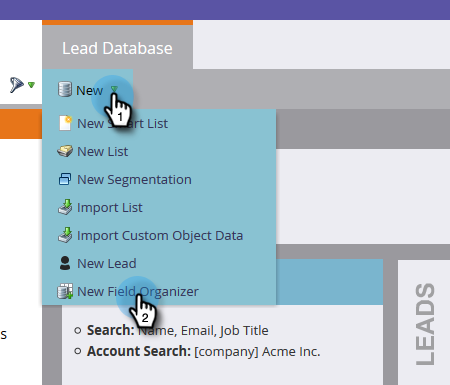

# Création de groupes de champs personnalisés à l’aide de l’Organiseur de champs {#create-custom-field-groups-using-the-field-organizer}

Avant d’activer les groupes de champs personnalisés pour la création de rapports dans la zone d’analyse des performances du modèle de l’Explorateur de cycle de revenus, vous devez classer les champs standard ou personnalisés en groupes pour la création de rapports via l’Organiseur de champs de la gestion des pistes Marketo. Cela s’applique uniquement aux attributs de prospect et de société.
Lorsque vous sélectionnez un champ standard ou personnalisé dans la liste déroulante Champ de la boîte de dialogue Nouvel Organiseur de champs , le système mappe le type de données Gestion des pistes Marketo associé au champ que vous souhaitez regrouper avec l’un des trois éditeurs disponibles dans l’Organiseur de champs : chaîne, entier ou date.

| Type de données de gestion des pistes Marketo | Type de données de l’éditeur d’organiseur de champ |
|---|---|
| Chaîne | Chaîne |
| E-mail | Chaîne |
| Entier | Entier |
| Texte | Chaîne |
| URL | Chaîne |
| Référence | Non pris en charge |
| Devise | Entier |
| DateHeure | Date |
| Booléenne | Non pris en charge |
| Téléphone | Chaîne |
| Date | Date |
| Flottante | Entier |
| Calculé | Non pris en charge |

Les trois sections suivantes décrivent comment créer un groupe de champs personnalisé pour un type chaîne, entier ou date.

## Créer un groupe de champs personnalisé - Éditeur de chaînes {#create-custom-field-group-string-editor}

1. Cliquez sur **Base de données de piste**.

   

1. Cliquez sur **New**, puis sélectionnez **New Field Organizer**.

   

1. Cliquez sur **Field** et sélectionnez un champ standard ou personnalisé avec un type de données qui correspond à l’éditeur de chaînes (voir le tableau de la section précédente). Le pays est utilisé ici.

   

1. Cliquez sur **Créer**.

   

   Le nouveau groupe personnalisé s’affiche dans l’arborescence de la base de données de piste, sous la forme Nom du champ > Groupe de noms de champ (exemple : Pays > Groupe de pays).

   

1. Cliquez sur l’icône représentant un crayon pour personnaliser le nom. Par exemple, vous pouvez renommer &quot;Groupe de pays&quot; en &quot;Continent&quot;. Saisissez le nouveau nom de votre choix et cliquez en dehors de la zone pour enregistrer automatiquement.

   

1. Par défaut, toutes les valeurs de données sont placées dans le sous-groupe &quot;Autre&quot;. Pour classer les valeurs de données par catégorie, cliquez sur **Ajouter un groupe** pour créer un sous-groupe et lui donner un nom.

   >[!NOTE]
   >
   >Vous pouvez ajouter jusqu’à dix sous-groupes pour classer les valeurs de données. Un numéro d’identification est attribué à chaque sous-groupe créé.

   Dans cet exemple, des groupes ont été créés pour la plupart des continents.

   

   >[!NOTE]
   >
   >Pour supprimer un sous-groupe, il vous suffit de cliquer sur le X rouge en regard du nom du sous-groupe. Si le groupe contient des valeurs de données, celles-ci seront déplacées vers le groupe par défaut Autre.

1. Mettez en surbrillance une ou plusieurs valeurs de données dans la zone de travail, puis faites glisser et déposez-les dans le sous-groupe approprié.

   

   >[!NOTE]
   >
   >Pour supprimer une valeur de données d’un sous-groupe, réaffectez la valeur de données au groupe par défaut Autre.

1. Utilisez l’option de filtrage située dans le coin supérieur gauche directement au-dessus de la zone de travail pour sélectionner et afficher les valeurs des données dans un ou plusieurs sous-groupes. Les valeurs de données basées sur votre sélection de filtre s’affichent dans la zone de travail.

   

   >[!NOTE]
   >
   >Une fois les groupes définis, vous pouvez activer le groupe de champs personnalisé pour la création de rapports dans l’ analyse des performances du modèle (Leads) via l’onglet Analyses du cycle de revenu dans la gestion des pistes de Marketo.

## Créer un groupe de champs personnalisé - Éditeur entier {#create-custom-field-group-integer-editor}

1. Cliquez sur **Base de données de piste**.

   

1. Cliquez sur **New**, puis sélectionnez **New Field Organizer**.

   

1. Cliquez sur **Field** et sélectionnez un champ standard ou personnalisé avec un type de données qui correspond à l’éditeur de chaînes (voir le tableau de la section précédente). Les recettes annuelles sont utilisées ici.

   

1. Cliquez sur **Créer**.

   

   Le nouveau groupe personnalisé s’affiche dans l’arborescence de la base de données de piste, sous la forme Nom du champ > Groupe Nom du champ (par exemple : Recettes annuelles > Groupe Recettes annuelles).

   

1. Cliquez sur le nom du groupe personnalisé par défaut au-dessus de l’éditeur d’entiers pour personnaliser le nom. Par exemple, vous pouvez renommer &quot;Groupe des recettes annuelles&quot; en &quot;Recettes annuelles par taille&quot;. Cliquez sur **Enregistrer**.

   

   L’éditeur d’entiers vous permet de créer plusieurs sous-groupes afin de définir chaque sous-groupe par taille. Dans cet exemple, trois groupes seront créés pour les PME, Medium et Enterprise.

1. Pour ajouter votre premier groupe, saisissez un nom dans le champ **Nom du groupe** (exemple : Petit) et saisissez une valeur maximale dans le champ **Plage du groupe** (exemple : 200000). Cliquez sur **Ajouter un groupe**.

   

   Une entrée de groupe vide s’affiche sous le groupe qui vient d’être saisi. L’exemple ci-dessous illustre une entrée pour les PME, Medium et Enterprise.

   >[!NOTE]
   >
   >Vous pouvez ajouter jusqu’à dix sous-groupes pour classer les valeurs de données. Chaque entrée de plage de groupes s’appuie sur l’entrée précédente. Si vous laissez la dernière entrée de plage de groupes vide pour le dernier sous-groupe personnalisé que vous créez, aucune valeur de données maximale n’est définie.

1. Cliquez sur l’onglet Résumé pour enregistrer et consulter vos paramètres.

   

   >[!NOTE]
   >
   >Pour supprimer un sous-groupe, cliquez sur le X rouge en regard du nom du sous-groupe.

1. Dans la page Résumé, passez en revue vos paramètres.

   

   >[!NOTE]
   >
   >Une fois les groupes définis, vous pouvez activer le groupe de champs personnalisé pour la création de rapports dans l’ analyse des performances du modèle (Leads) via l’onglet Analyses du cycle de revenu dans la gestion des pistes de Marketo.

## Créer un groupe de champs personnalisé - Éditeur de dates {#create-custom-field-group-date-editor}

1. Cliquez sur **Base de données de piste**.

   

1. Cliquez sur **New**, puis sélectionnez **New Field Organizer**.

   

1. Cliquez sur **Field** et sélectionnez un champ standard ou personnalisé avec un type de données qui correspond à l’éditeur de chaînes (voir le tableau de la section précédente). La date d’acquisition est utilisée ici.

   

1. Cliquez sur **Créer**.

   

   Le nouveau groupe personnalisé s’affiche dans l’arborescence de la base de données de piste, sous la forme Nom du champ > Groupe de noms de champ (exemple : Date d’acquisition > Groupe de dates d’acquisition).

   

1. Cliquez sur le nom du groupe personnalisé par défaut situé au-dessus de l’éditeur de date pour personnaliser le nom. Par exemple, vous pouvez renommer &quot;Groupe de dates d’acquisition&quot; en &quot;Catégories de dates d’acquisition&quot;. Cliquez sur **Enregistrer**.

   

   L&#39;éditeur de date permet de créer plusieurs sous-groupes et de définir chaque sous-groupe par date. Dans cet exemple, trois groupes seront créés : Q1-15 Leads, Q2-15 Leads et Q3-15 Leads.

1. Pour ajouter votre premier groupe, saisissez un nom dans le champ **Nom du groupe** (par exemple : Q1-15 Pistes) et saisissez une date dans le champ de date qui représente la date à laquelle la piste a été acquise au plus tôt (par exemple : 3/31/2015 pour le dernier jour du 1er-15). Cliquez sur **Ajouter un groupe**.

   

   >[!NOTE]
   >
   >Vous pouvez ajouter jusqu’à dix sous-groupes pour classer les valeurs de données. Chaque entrée de plage de groupes s’appuie sur l’entrée précédente. Si vous laissez la dernière entrée de plage de groupes vide pour le dernier sous-groupe personnalisé que vous créez, aucune valeur de date de fin n’est définie.

   L’exemple ci-dessous illustre une entrée pour le premier trimestre 2015 qui passe par le troisième trimestre.

   

   Et c&#39;est tout ! C&#39;est bien.
