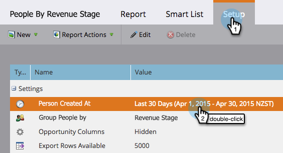

# Rapport d’étape Personnes par chiffre d’affaires {#people-by-revenue-stage-report}

Vous pouvez créer un rapport indiquant dans quelle étape de votre modèle de cycle du revenu vos clients se trouvent. Le rapport inclut n’importe quelle étape du modèle spécifié tant qu’il existe un solde de personne pour la période donnée du rapport.

>[!AVAILABILITY]
>
>Toutes les éditions Marketo ne comprennent pas cette fonctionnalité. Pour plus d’informations, contactez votre gestionnaire de compte.

1. Accédez à **Analytics**.

   

1. Cliquez sur le rapport pour **Personnes par étape de chiffre d’affaires**.

   

1. Cliquez sur l’onglet **Setup** . Double-cliquez sur le champ **Personne créée à l’emplacement** pour définir la période sur laquelle vous souhaitez créer des rapports.

   

1. Modifiez la période et cliquez sur **Enregistrer**.

   

1. Cliquez sur l’onglet **Rapport** . Vous pouvez maintenant voir dans quelle étape de votre modèle de revenu vos employés se trouvent et vous concentrer sur n&#39;importe quel goulot d&#39;étranglement.

   
