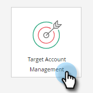
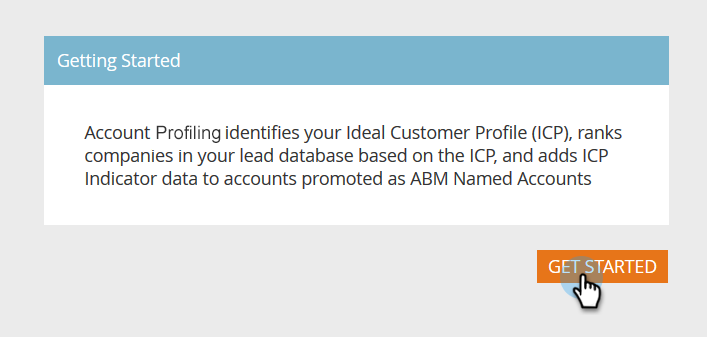
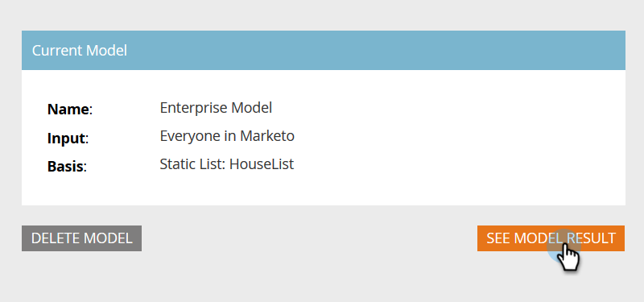
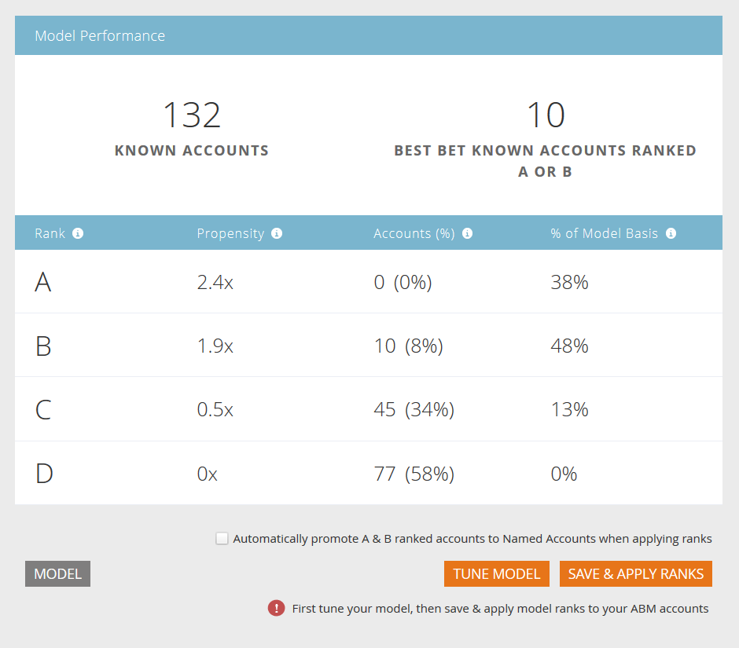

# Configuration d’Account Profiling {#setting-up-account-profiling}

Pour commencer à utiliser le profilage de compte, procédez comme suit.

>[!IMPORTANT]
>
>Depuis 2025, le profilage de compte n’est plus disponible pour les nouveaux utilisateurs. Il continuera à fonctionner pour les utilisateurs existants.

>[!CAUTION]
>
>Les champs suivants ne doivent **pas** masqués pour que le profilage de compte fonctionne correctement.
>
>* Site web
>* Société
>* E-mail
>* Pays
>
>Découvrez comment [afficher un champ ici](/help/marketo/product-docs/administration/field-management/hide-and-unhide-a-field.md#unhide-a-field).

1. Dans Mon Marketo, ouvrez **[!UICONTROL Gestion du compte Target]**.

   

1. Cliquez sur l’onglet **[!UICONTROL Profils de compte]**.

   

1. L’onglet Modèle est ouvert par défaut. Cliquez sur **[!UICONTROL Commencer]**.

   

1. Attribuez un nom à votre modèle et sélectionnez le type/la liste de personnes qui serviront de base pour le profil client idéal (ICP). Cliquez sur **[!UICONTROL Créer un modèle]** lorsque vous avez terminé.

   

1. Votre modèle commencera sa création. Cela peut prendre un certain temps, mais ne vous inquiétez pas, vous serez averti lorsque cela sera fait.

   

1. Pour afficher les résultats de votre modèle, cliquez sur **[!UICONTROL Voir le résultat du modèle]**.

   

   Votre modèle est maintenant créé.

   

   >[!TIP]
   >
   >Maintenant que votre modèle est créé, [apprenez à l’ajuster](/help/marketo/product-docs/target-account-management/account-profiling/account-profiling-ranking-and-tuning.md).
