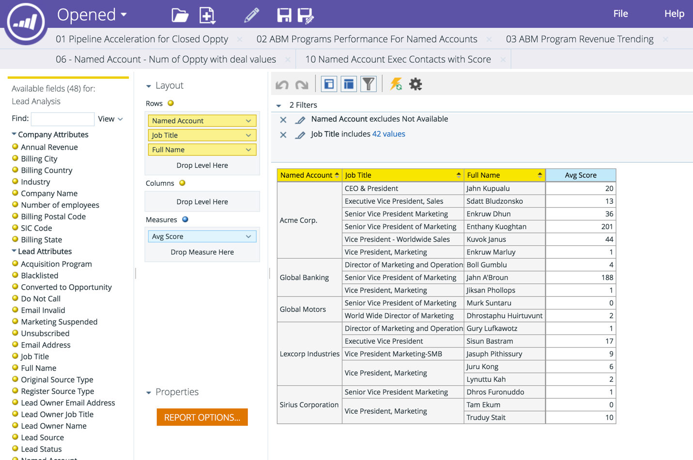

# Dimension de compte nommé dans RCA {#named-account-dimension-in-rca}

Créez des rapports basés sur le chiffre d’affaires à l’aide de la dimension Compte nommé spécifique à la gestion des balises dans Revenue Cycle Analytics.

>[!NOTE]
>
>**Dimensions** - Attributs (représentés par des points jaunes) qui offrent différentes vues des mesures.

>[!NOTE]
>
>La dimension Compte nommé dans RCA peut être utilisée pour mesurer l’impact financier des comptes ciblés (par exemple, les recettes gagnées, les pipelines générés ou l’accélération du cycle de vente). Cette dimension peut également être utilisée pour identifier les programmes qui ont obtenu de bons résultats par rapport aux comptes nommés.

Les rapports suivants ont accès à la dimension Compte nommé :

* Analyse d’e-mail
* Analyse de lead
* Analyse d&#39;opportunité
* Analyse de l’appartenance à un programme

>[!NOTE]
>
>Vous trouverez ci-dessous quelques exemples de Marketo TAM dans Revenue Cycle Analytics.

Accélération du pipeline dans les comptes nommés

Efficacité et succès des canaux par comptes nommés

Efficacité du programme et impact sur les résultats

Couverture des leads de qualité et engagement dans les comptes nommés

