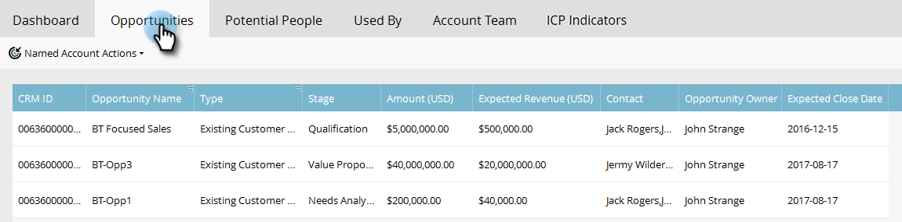

# Informations sur les comptes nommés {#named-account-insights}

Le tableau de bord du compte nommé offre une vue à 360 degrés d’un compte cible.

## Tableau de bord {#dashboard}

Le tableau de bord rassemble les informations clés au niveau du compte de toutes les personnes d’un compte nommé, évitant ainsi d’avoir à se rendre à chaque personne pour évaluer sa progression. Vous pouvez approfondir l’analyse de l’activité de courrier électronique à l’aide de [Email Insights](/help/marketo/product-docs/reporting/email-insights/filtering-in-email-insights.md#account-based-marketing).

>[!NOTE]
>
>Les diagrammes présentent les informations sur les 90 derniers jours.

**Engagement du compte dans le temps** Cliquez sur la liste déroulante **Afficher** à droite pour modifier ce que vous affichez. Outre la note du compte, vous pouvez l’afficher par recettes totales...

...ou pipeline.

<table> 
 <tbody> 
  <tr> 
   <td><strong>Évaluation du compte</strong></td> 
   <td>
Consultez l’engagement hebdomadaire en fonction de tous les scores de compte que vous avez créés dans Admin. Vous pouvez comparer ces scores de compte côte à côte. Pour déterminer l’engagement hebdomadaire, nous prenons l’engagement maximal de n’importe quel jour de la semaine.
</td> 
  </tr> 
  <tr> 
   <td><strong>Pipeline</strong></td> 
   <td>Voir le pipeline au fil du temps. Pour déterminer le pipeline au fil du temps, nous prenons le pipeline le dernier jour.</td> 
  </tr> 
  <tr> 
   <td><strong>Recettes</strong></td> 
   <td>Voir les recettes au fil du temps. Pour déterminer les recettes au fil du temps, nous prenons la somme de toutes les recettes gagnées au cours de cette semaine.</td> 
  </tr> 
 </tbody> 
</table>

**Moments intéressants**

Disponible pour les utilisateurs de Marketo Sales Insight, découvrez les moments intéressants cumulés au niveau du compte.

**Top People**

Ces personnes sont calculées en fonction des priorités basées sur la récence ou l’urgence affichées par les personnes de comptes nommés (comme les [meilleurs paris](/help/marketo/product-docs/marketo-sales-insight/msi-for-salesforce/features/stars-and-flames/priority-urgency-relative-score-and-best-bets.md) dans Sales Insight) ou les scores définis par l’utilisateur. **Priority** n’est disponible que pour les utilisateurs de Marketo Sales Insight.

**Inclut Des Enfants**

Cliquez sur **Inclut les enfants** pour afficher et sélectionner les comptes enfants du compte nommé sélectionné et afficher leurs analyses d’agrégats.

>[!NOTE]
>
>Lors de la sélection de comptes, vous pouvez sélectionner tout ou sélectionner individuellement jusqu’à 100 comptes.

## Hiérarchie {#hierarchy}

Afficher l’emplacement du compte nommé sélectionné par rapport à sa hiérarchie.

## Opportunités {#opportunities}

Vue cumulée de toutes les opportunités ouvertes au niveau du compte, permettant aux équipes marketing de se concentrer sur la fermeture d’opportunités spécifiques.

## Personne potentielle {#potential-people}

La mise en correspondance de piste/compte utilise une logique floue pour trouver des correspondances faibles qui peuvent être résolues dans l’onglet Personnes potentielles .

>[!NOTE]
>
>Pour ajouter l’une des personnes répertoriées, sélectionnez-les et cliquez sur **Ajouter des personnes**.

## Utilisé par {#used-by}

Cet onglet indique les campagnes intelligentes, les campagnes web, les listes intelligentes ou les rapports qui font actuellement référence à des comptes ou des listes de comptes spécifiques.

## Équipe responsable du compte {#account-team}

Affichez les membres de l’équipe du compte, ajoutez/supprimez des membres, et affectez même un propriétaire de compte dans cet onglet.

>[!NOTE]
>
>Cliquez sur la liste déroulante **Actions de l’équipe de compte** pour ajouter/supprimer des membres du compte ou affecter un propriétaire de compte.

## Indicateurs ICP {#icp-indicators}

Affichez les indicateurs ICP que vous avez sélectionnés pour l’exportation lorsque vous avez [réglé votre modèle](/help/marketo/product-docs/target-account-management/account-profiling/account-profiling-ranking-and-tuning.md#model-tuning).

