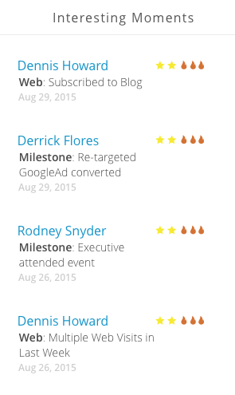

# Informations sur le compte nommé {#named-account-insights}

Le tableau de bord des comptes nommés offre une vue à 360 degrés d’un compte cible.

## Tableau de bord {#dashboard}

Le tableau de bord agrège les informations clés au niveau d’un compte de toutes les personnes au sein d’un compte nommé, évitant ainsi d’avoir à consulter chaque personne pour évaluer sa progression. Vous pouvez analyser plus en détail l’activité des e-mails à l’aide de [Informations sur les e-mails](/help/marketo/product-docs/reporting/email-insights/filtering-in-email-insights.md#account-based-marketing).

>[!NOTE]
>
>Les graphiques affichent les informations des 90 derniers jours.

**[!UICONTROL Engagement du compte au fil du temps]** cliquez sur le menu déroulant **[!UICONTROL Affichage]** à droite pour modifier ce que vous affichez. En plus de [!UICONTROL Score du compte], vous pouvez afficher par [!UICONTROL Chiffre d’affaires total]...

...ou [!UICONTROL Pipeline].

<table>
 <tbody>
  <tr>
   <td><strong>Score du compte</strong></td>
   <td>
Consultez l’engagement semaine par semaine en fonction de tous les scores de compte que vous avez créés dans Admin. Vous pouvez comparer les scores de ces comptes côte à côte. Pour déterminer l’engagement hebdomadaire, nous prenons l’engagement maximal à partir de n’importe quel jour de la semaine.
</td>
  </tr>
  <tr>
   <td><strong>Pipeline</strong></td>
   <td>Voir le pipeline au fil du temps. Pour déterminer le pipeline au fil du temps par semaine, nous prenons le pipeline le dernier jour.</td>
  </tr>
  <tr>
   <td><strong>Recettes</strong></td>
   <td>Afficher les revenus au fil du temps. Pour déterminer les revenus au fil du temps par semaine, nous prenons la somme de tous les revenus gagnés au cours de cette semaine.</td>
  </tr>
 </tbody>
</table>

**[!UICONTROL Moments significatifs]**

Disponible pour les utilisateurs de [!DNL Marketo Sales Insight], consultez les moments intéressants remontés au niveau d’un compte.

**Principales personnes**

Ces personnes sont calculées en fonction des priorités basées sur la récence ou l’urgence affichée par des personnes de comptes nommés (identique aux [&#x200B; Meilleurs résultats &#x200B;](/help/marketo/product-docs/marketo-sales-insight/msi-for-salesforce/features/stars-and-flames/priority-urgency-relative-score-and-best-bets.md) dans Sales Insight), ou sur les scores définis par l’utilisateur. **[!UICONTROL Priorité]** n’est disponible que pour les utilisateurs et utilisatrices de [!DNL Marketo Sales Insight].

**Inclut les enfants**

Cliquez sur **[!UICONTROL Inclut les enfants]** pour afficher et choisir les comptes enfants du compte nommé sélectionné et afficher leurs analyses agrégées.

>[!NOTE]
>
>Lors de la sélection de comptes, vous pouvez choisir de tout sélectionner ou de sélectionner individuellement jusqu’à 100 comptes.

## Hierarchy (Hiérarchie) {#hierarchy}

Voir où se trouve le compte nommé sélectionné par rapport à sa hiérarchie.

## [!UICONTROL &#x200B; Opportunités &#x200B;] {#opportunities}

Une vue cumulée de toutes les opportunités ouvertes au niveau d’un compte, qui aide les équipes marketing à se concentrer sur la fermeture d’opportunités spécifiques.

## [!UICONTROL Personnes potentielles] {#potential-people}

La correspondance entre les leads et les comptes utilise une logique floue pour trouver les correspondances faibles qui peuvent être résolues dans l’onglet [!UICONTROL Personnes potentielles].

>[!NOTE]
>
>Pour ajouter une personne de la liste, sélectionnez-la et cliquez sur **[!UICONTROL Ajouter des personnes]**.

## [!UICONTROL Utilisé par] {#used-by}

Cet onglet affiche les campagnes intelligentes, les campagnes web, les listes intelligentes ou les rapports qui font actuellement référence à des comptes nommés ou à des listes de comptes spécifiques.

## [!UICONTROL Équipe de compte] {#account-team}

Affichez les membres de l’équipe du compte, ajoutez/supprimez des membres et attribuez même un propriétaire de compte dans cet onglet.

>[!NOTE]
>
>Cliquez sur le menu déroulant **[!UICONTROL Actions de l’équipe du compte]** pour ajouter/supprimer des membres de compte ou attribuer un propriétaire de compte.

## [!UICONTROL Indicateurs ICP] {#icp-indicators}

Affichez les [!UICONTROL indicateurs ICP] que vous avez sélectionnés pour l’exportation lorsque vous avez [réglé votre modèle](/help/marketo/product-docs/target-account-management/account-profiling/account-profiling-ranking-and-tuning.md#model-tuning).

