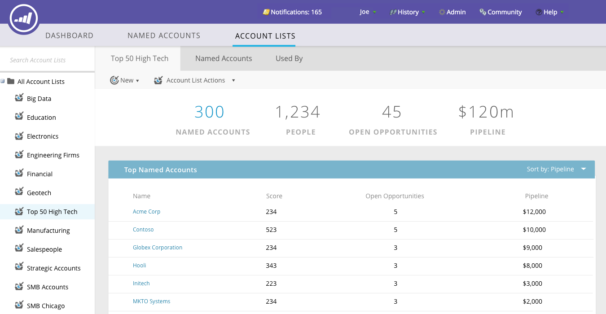

# Tableau de bord principal de TAM {#tam-main-dashboard}

Le tableau de bord principal présente un résumé de vos efforts [!UICONTROL Gestion de compte Target]. Vous pouvez voir les comptes cibles ou les listes de comptes qui affichent le succès, ainsi que ceux qui nécessitent plus d’attention.

Pour filtrer par liste de comptes, cliquez sur le menu déroulant **[!UICONTROL Affichage]**...

...et effectuez une sélection. Dans cet exemple, nous choisissons notre liste de comptes « **[!UICONTROL High Tech]** ».

Pour afficher le tableau de bord [Liste des comptes](/help/marketo/product-docs/target-account-management/measure/account-list-insights.md#account-list-dashboard), cliquez sur le nom de la liste de comptes que vous avez sélectionnée...

...et le tableau de bord se charge.

Si, au lieu d’afficher le tableau de bord Liste des comptes, vous souhaitez explorer un compte nommé, cliquez sur **[!UICONTROL Plus de détails]** sous son nom...

...et afficher les informations du [compte nommé](/help/marketo/product-docs/target-account-management/measure/named-account-insights.md).

