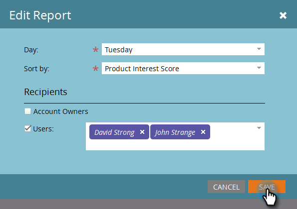

# Configuration du rapport TAM {#tam-report-setup}

Le rapport des ventes du gestionnaire de comptes techniques est un e-mail personnalisé envoyé chaque semaine à l’équipe du compte.

## Configuration du rapport {#report-setup}

1. Cliquez sur **[!UICONTROL Admin]**.

   

1. Cliquez sur **[!UICONTROL Gestion du compte Target]**.

   

1. Sous [!UICONTROL &#x200B; Rapport hebdomadaire &#x200B;], cliquez sur **[!UICONTROL Modifier]**.

   

1. Cliquez sur le menu déroulant **[!UICONTROL Jour]** et sélectionnez le jour de la semaine où vous souhaitez que les destinataires reçoivent l’e-mail.

   

1. Pour déterminer la disposition de votre e-mail, cliquez sur le menu déroulant **[!UICONTROL Trier par]** et effectuez une sélection.

   

1. Cochez la case **[!UICONTROL Utilisateurs]**, puis cliquez sur la liste déroulante et sélectionnez la personne à qui vous souhaitez envoyer l’e-mail.

   

   >[!NOTE]
   >
   >Les notifications seront envoyées uniquement aux propriétaires de compte ou aux membres de l’équipe.

1. Cliquez sur **[!UICONTROL Enregistrer]**

   

Et c&#39;est tout !

## Comment se désabonner {#how-to-unsubscribe}

Chaque rapport est fourni avec une option de désinscription. Pour ce faire, cliquez simplement sur **[!UICONTROL Se désabonner]** au bas de l’e-mail.

## Comment se réabonner {#how-to-resubscribe}

1. Cliquez sur **[!UICONTROL Admin]**.

   

1. Cliquez sur **[!UICONTROL Gestion du compte Target]**.

   

1. Sous [!UICONTROL Rapport hebdomadaire], cliquez sur le numéro indiqué comme [!UICONTROL Désabonné].

   

1. Cliquez sur la liste déroulante **[!UICONTROL Utilisateurs]**.

   

1. Sélectionnez à nouveau l’utilisateur auquel vous souhaitez envoyer des e-mails et cliquez sur **[!UICONTROL Se réabonner]**.

   
