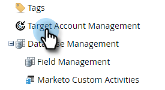

# Configuration du rapport TAM {#tam-report-setup}

Le rapport Ventes de la gestion des actifs numériques est un courrier électronique hebdomadaire personnalisé envoyé à l’équipe du compte.

## Configuration des rapports {#report-setup}

1. Cliquez sur **Administration**.

   

1. Cliquez sur **Gestion de compte Target**.

   

1. Sous Rapport hebdomadaire, cliquez sur **Modifier**.

   

1. Cliquez sur le bouton **Jour** et sélectionnez le jour de la semaine où vous souhaitez que les destinataires reçoivent l&#39;email.

   

1. Pour déterminer la mise en page de votre email, cliquez sur le bouton **Trier par** et effectuez une sélection.

   

1. Vérifiez les **Utilisateurs** , puis cliquez sur la liste déroulante et sélectionnez la personne à qui vous souhaitez envoyer l’email.

   

   >[!NOTE]
   >
   >Les notifications seront uniquement envoyées aux propriétaires de compte ou aux membres de l’équipe.

1. Cliquez sur **Enregistrer**.

   

Et voilà !

## Comment se désabonner {#how-to-unsubscribe}

Chaque rapport est assorti d’une option d’exclusion. Pour ce faire, cliquez simplement sur **Désabonner** au bas de l’email.

## Comment se désabonner {#how-to-resubscribe}

1. Cliquez sur **Administration**.

   

1. Cliquez sur **Gestion de compte Target**.

   

1. Sous Rapport hebdomadaire, cliquez sur le numéro Désabonné.

   

1. Cliquez sur le bouton **Utilisateurs** menu déroulant.

   

1. Sélectionnez l’utilisateur pour lequel vous souhaitez recevoir à nouveau des emails et cliquez sur **Resubscribe**.

   
