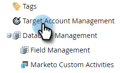

# Configuration du rapport TAM {#tam-report-setup}

Le rapport Ventes TAM est un courriel hebdomadaire personnalisé envoyé à l’équipe du compte.

## Configuration du rapport {#report-setup}

1. Cliquez sur **Admin**.

   

1. Cliquez sur **Gestion du compte de Cible**.

   

1. Sous Rapport hebdomadaire, cliquez sur **Modifier**.

   

1. Cliquez sur la liste déroulante **Jour** et sélectionnez le jour de la semaine où vous souhaitez que les destinataires reçoivent le courriel.

   

1. Pour déterminer la mise en page de votre courrier électronique, cliquez sur la liste déroulante **Trier par** et effectuez une sélection.

   

1. Cochez la case **Utilisateurs**, puis cliquez sur la liste déroulante et sélectionnez qui recevoir le courrier électronique.

   

   >[!NOTE]
   >
   >Les notifications ne seront envoyées qu&#39;aux propriétaires de compte ou aux membres de l&#39;équipe.

1. Cliquez sur **Enregistrer**.

   

Et c&#39;est tout !

## Comment se désabonner {#how-to-unsubscribe}

Chaque rapport comporte l’option de opt-out. Pour ce faire, il vous suffit de cliquer sur **Désabonner** au bas du courrier électronique.

## Comment réabonner {#how-to-resubscribe}

1. Cliquez sur **Admin**.

   

1. Cliquez sur **Gestion du compte de Cible**.

   

1. Sous Rapport hebdomadaire, cliquez sur le numéro indiqué comme Non inscrit.

   

1. Cliquez sur la liste déroulante **Utilisateurs**.

   

1. Sélectionnez l’utilisateur que vous souhaitez de nouveau recevoir des courriers électroniques et cliquez sur **Reprendre**.

   
