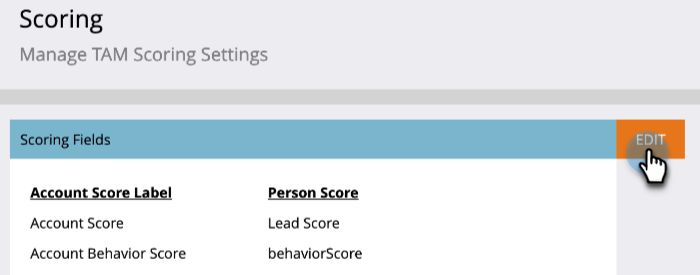

# [!UICONTROL Score du compte] {#account-score}

La notation de compte est une partie essentielle de la [!UICONTROL gestion des comptes Target]. Cela vous aide à déterminer le niveau d’engagement de vos comptes.

## Qu’est-ce que l’évaluation de compte ? {#what-is-account-scoring}

Il s’agit d’une approche systématique conçue pour aider les équipes de vente et de marketing à identifier et à hiérarchiser les entreprises (y compris les prospects) les plus susceptibles de réaliser un achat.

Dans le monde complexe des processus d’achat B2B, il est rare qu’une seule personne prenne une décision d’achat. Il y a souvent différents rôles en jeu, chacun ayant ses propres besoins. La notation basée sur les comptes en tient compte en agrégeant les scores des prospects de plusieurs prospects et en fournissant un score au niveau du compte.

## Exemples courants {#common-examples}

<table>
 <tbody>
  <tr>
   <td><strong>Score d'engagement</strong></td>
   <td>Profondeur d’engagement basée sur les activités comportementales suivies sur divers canaux (e-mail, web, etc.) par des personnes appartenant à des comptes cibles spécifiques.</td>
  </tr>
  <tr>
   <td><strong>Note d’intérêt du produit du compte</strong></td>
   <td>Les utilisateurs des comptes cibles qui montrent un intérêt pour le contenu d’un produit spécifique (par exemple, le téléchargement d’un article technique).</td>
  </tr>
  <tr>
   <td><strong>Score de l’engagement web du compte</strong></td>
   <td>Personnes issues de comptes cibles visitant le canal web. Un même score peut être créé pour mesurer l’engagement du canal à partir des e-mails, des publicités ou d’autres canaux.</td>
  </tr>
 </tbody>
</table>

## Configuration de l’évaluation de compte {#how-to-configure-account-score}

>[!NOTE]
>
>Pour calculer les scores du compte, vous devez d’abord créer les scores des prospects. Marketo TAM agrège automatiquement les scores de prospect aux scores de compte. Par exemple, nous allons prendre deux des exemples ci-dessus (_score de l’intérêt du produit du compte_ et _score de l’engagement sur le web du compte_).
>
>Créez tout d’abord des champs de score de prospect qui capturent les détails pertinents de chaque prospect d’un compte cible.
>>Attribuez ensuite ces scores de prospect à leurs scores de compte respectifs :
>>Note d’intérêt du produit du compte = SOMME (note d’intérêt du produit du lead)
>>Score de l’engagement web du compte = SUM (score de l’engagement web du lead)

>[!NOTE]
>
>Les utilisateurs peuvent créer plusieurs scores d’engagement de compte et attribuer différents scores de personne à différents scores de compte.

Une fois que vous avez configuré le score du prospect, procédez comme suit.

1. Cliquez sur **[!UICONTROL Admin]**.

   

1. Cliquez sur **[!UICONTROL Gestion du compte Target]**.

   

1. Dans [!UICONTROL Champs de notation], cliquez sur **[!UICONTROL Modifier]**.

   

   >[!NOTE]
   >
   >Vous pouvez choisir jusqu’à **cinq** champs pour calculer le [!UICONTROL score du compte].

1. Saisissez le nom [!UICONTROL Score du compte], cliquez sur le menu déroulant **[!UICONTROL Sélectionner le score de la personne]** et sélectionnez le score correspondant.

   

1. Cliquez sur **[!UICONTROL +Ajouter]** pour ajouter d’autres scores.

   

1. Ajoutez tous les scores souhaités. Cliquez sur **[!UICONTROL Enregistrer]** lorsque vous avez terminé.

   
