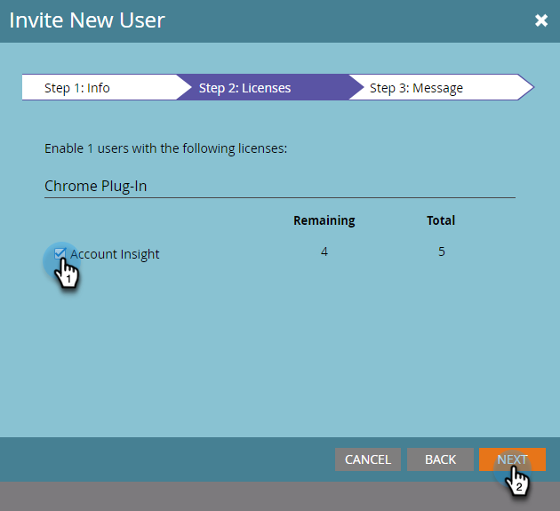

# Invitation d’utilisateurs à accéder à Insight de compte {#invite-users-to-access-account-insight}

Suivez ces étapes pour permettre aux utilisateurs d’accéder à Account Insight.

1. Cliquez sur **Admin**.

   

1. Cliquez sur **Utilisateurs et rôles** dans l’arborescence. Cliquez ensuite sur l’onglet **Utilisateurs commerciaux** et **Inviter de nouveaux utilisateurs commerciaux**.

   

   Il existe deux manières d&#39;inviter des utilisateurs : par CRM ou par email. Dans cet exemple, nous utiliserons Invitation par CRM.

   >[!NOTE]
   >
   >Lors de l’invitation de nouveaux utilisateurs (non Marketo) via la liste d’utilisateurs CRM, vous pouvez inviter plusieurs personnes à la fois. L&#39;invitation par email est 1 pour 1.

1. Cliquez sur la liste déroulante **Utilisateur CRM** et sélectionnez un utilisateur.

   

   >[!NOTE]
   >
   >Si vous choisissez **Inviter un utilisateur par e-mail**, saisissez simplement son prénom, son nom et son adresse e-mail, puis passez à l’étape 4.

1. Pour définir une date d’expiration de l’accès de l’utilisateur (facultatif), cliquez sur l’icône de calendrier. Par défaut, il est défini sur &quot;jamais&quot;.

   

1. Cliquez sur **Suivant**.

   

1. Cochez la case **Account Insight** et cliquez sur **Suivant**.

   

1. Examinez le message envoyé, apportez les modifications souhaitées (facultatif) et cliquez sur **Envoyer**.

   
