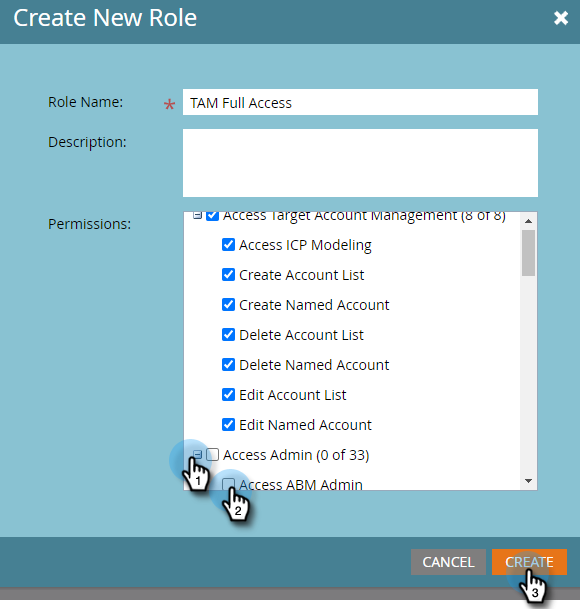

# Permissions {#permissions}

Vous devrez configurer des autorisations pour que vos utilisateurs puissent utiliser la gestion des ressources numériques (TAM). Voici comment.

1. Cliquez sur **Administration**.

   

1. Cliquez sur **Utilisateurs et rôles**.

   

   >[!NOTE]
   >
   >Vous pouvez ajouter des autorisations TAM pour un rôle existant ou en créer un tout nouveau. Cet exemple utilise un nouveau rôle.

1. Cliquez sur **Rôles**, puis **Nouveau rôle**.

   

1. Saisissez un nom de rôle et cliquez sur le bouton **+** en regard de la case à cocher Accéder à la gestion de compte Target .

   

1. Pour sélectionner _all_ autorisations, il vous suffit de vérifier **Accès à la gestion de compte Target** .

   

   >[!NOTE]
   >
   >Vous avez également la possibilité de sélectionner certaines des options. Pour ce faire, cochez chaque case individuellement.

1. Cliquez sur le bouton **+** pour ouvrir le menu Accès à l’administrateur . Vérifiez les **Accès à l’administrateur ABM** case à cocher (ABM est le nom précédent de TAM) et cliquez sur **Créer**.

   

   Votre nouveau rôle TAM est maintenant prêt à être [affecté à un utilisateur](/help/marketo/product-docs/administration/users-and-roles/managing-user-roles-and-permissions.md#assign-roles-to-a-user)!
