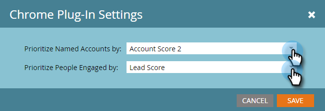

# Configuration d’Insight de compte {#set-up-account-insight}

Voici comment configurer le compte Insight.

>[!PREREQUISITES]
>
>Le score du compte TAM [doit d’abord être configuré](/help/marketo/product-docs/target-account-management/setup-tam/account-score.md).

1. Cliquez sur **[!UICONTROL Admin]**.

   

1. Cliquez sur **[!UICONTROL Gestion du compte Target]** dans l’arborescence, puis sur l’onglet **[!UICONTROL Ventes]**.

   

1. Cliquez sur **[!UICONTROL Modifier]**.

   

1. Cliquez sur les listes déroulantes pour choisir la manière dont le compte Insight donne la priorité aux comptes nommés et aux personnes engagées.

   

   >[!NOTE]
   >
   >Si les paramètres [Account Score](/help/marketo/product-docs/target-account-management/setup-tam/account-score.md) sont mis à jour à tout moment, la configuration sous Ventes doit être mise à jour par un administrateur pour s’assurer que les scores reflètent fidèlement les préférences de l’utilisateur. L’utilisateur doit se déconnecter puis se reconnecter pour voir les modifications.

1. Cliquez sur **[!UICONTROL Enregistrer]**.

   
