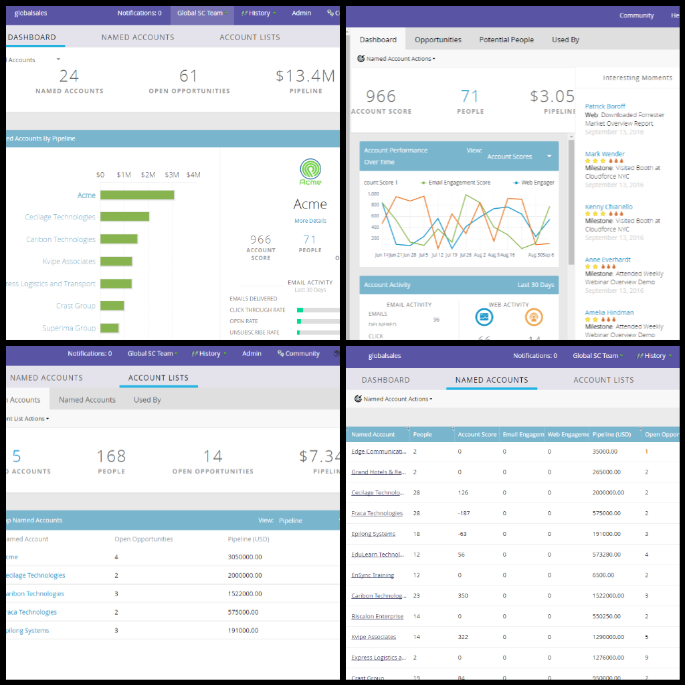

# [!UICONTROL Gestion du compte Target] {#target-account-management-overview}

Professionnel du marketing, rencontrez [!UICONTROL Gestion de compte Target]. [!UICONTROL Gestion de compte Target], rencontrez un spécialiste du marketing.

Qu’est-ce que Marketo [!UICONTROL gestion de compte Target] ?

Marketo [!UICONTROL Gestion de compte Target] rassemble les équipes commerciales et marketing pour cibler et impliquer les comptes clés de manière hautement coordonnée, en comblant le fossé entre la stratégie centrée sur le compte, l’exécution et le succès, le tout sur une seule plateforme.

Pourquoi utiliser Marketo [!UICONTROL gestion de compte Target] ?

Marketo unifie la gestion des TAM et des prospects dans une seule solution, ce qui permet aux spécialistes marketing d’exécuter facilement des campagnes personnalisées pour les comptes et les prospects en un seul mouvement. Vous bénéficiez également d’atteindre les principaux décideurs et influenceurs en matière d’affaires.

Marketo TAM se compose de trois composants :

**1) Cible**

* Identification des comptes
* Mise en correspondance des leads et des comptes
* Listes de comptes nommés

**2) S’engager**

* Personalization basé sur les comptes
* Engagement multicanal
* Workflows spécifiques au compte

**3) Mesure**

* Données sur les comptes et les listes
* Score d&#39;engagement
* Impact sur le pipeline et le chiffre d&#39;affaires

Marketo Account Based Marketing propose également divers outils pour personnaliser l’expérience du compte nommé sur l’ensemble des canaux.

* Personalization d’e-mail et de page de destination
* Web Personalization
* URL [&#128279;](/help/marketo/product-docs/demand-generation/landing-pages/personalizing-landing-pages/enable-personalized-urls-for-your-account.md)
* Annonce [&#128279;](/help/marketo/product-docs/demand-generation/facebook/create-a-custom-audience-in-facebook.md)
* [Personnalisé](/help/marketo/product-docs/web-personalization/website-retargeting/retargeting-with-web-personalization-data.md) Remarketing

J&#39;y suis ! Démarrage

On pensait que tu ne demanderais jamais ! La gestion des actifs numériques est disponible sous la forme d’un module complémentaire de votre abonnement Marketo. N’hésitez pas à contacter votre représentant commercial pour qu’elle soit mise en œuvre. Une fois que vous l’avez reçu, consultez cet article : [Prise en main de TAM](/help/marketo/product-docs/target-account-management/setup-tam/getting-started-with-tam.md).

>[!NOTE]
>
>Les comptes nommés gérés dans Marketo TAM sont directement accessibles à partir de Web TAM pour les besoins de personnalisation web. En savoir plus [ici](/help/marketo/product-docs/web-personalization/account-based-web-marketing/account-based-web-marketing-with-tam.md).

Bienvenue dans Marketo TAM et profitez du marketing ciblé !
