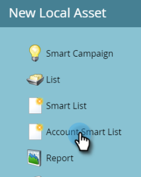
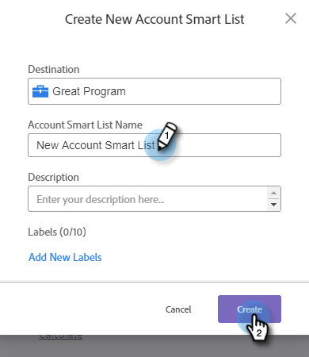
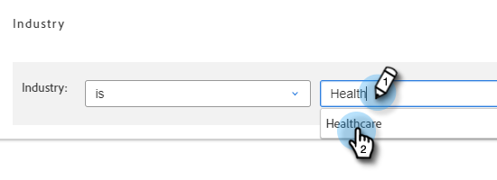

# Listes intelligentes de comptes {#account-smart-lists}

Voici comment identifier rapidement et précisément vos comptes à forte valeur ajoutée.

>[!NOTE]
>
>Cette fonctionnalité n’est disponible que pour les personnes disposant du module complémentaire [!UICONTROL Gestion de compte Target] et d’une TAM sous licence.

## Créer une [!UICONTROL liste dynamique de comptes] {#create-an-account-smart-list}

1. Dans Marketo, accédez à **[!UICONTROL Activités marketing]**.

   

1. Recherchez et sélectionnez le programme souhaité.

   

1. Cliquez sur la liste déroulante **[!UICONTROL Nouveau]** et sélectionnez **[!UICONTROL Nouvelle ressource locale]**.

   

1. Cliquez sur **[!UICONTROL Liste dynamique de compte]**.

   

1. Saisissez un nom et cliquez sur **[!UICONTROL Créer]** (la description et les libellés sont facultatifs).

   

Votre [!UICONTROL liste dynamique de compte] a été créée. Voir ci-dessous pour connaître la procédure de définition de ses règles.

## [!UICONTROL Liste dynamique de comptes] Règles {#account-smart-list-rules}

Le fonctionnement des [!UICONTROL listes dynamiques de comptes] est similaire à celui des listes dynamiques standard, avec une exception notable : les conteneurs.

1. Pour définir votre [!UICONTROL Liste dynamique de compte], cliquez sur l’onglet **[!UICONTROL Règles de liste dynamique de compte]**.

   

1. Choisissez le ou les filtres de compte souhaités. Dans cet exemple, nous choisissons _[!UICONTROL Industrie] est [!UICONTROL Santé]_.

   

   

   >[!NOTE]
   >
   >Les données d’indicateur ICP qui ont été utilisées dans votre [Classement et réglage du profil de compte](/help/marketo/product-docs/target-account-management/account-profiling/account-profiling-ranking-and-tuning.md) s’affichent en tant qu’attributs de compte personnalisés à utiliser dans votre liste dynamique de compte. Ces données d’attribut personnalisées sont basées sur la date à laquelle le modèle de profil de compte a été créé/mis à jour.

1. Choisissez le ou les filtres de personne correspondants. Dans cet exemple, nous choisissons _l’État est la Californie_.

   

**ÉTAPE FACULTATIVE** : C’est là que les conteneurs entrent en jeu. Si vous choisissez un filtre de personne correspondant supplémentaire, vous pouvez le déposer sous le premier, ou _y_ en créant un conteneur. Dans cet exemple, nous créons un conteneur en ajoutant _Le titre de la tâche est CFO_.

Voici à quoi ressemblera le conteneur.

>[!NOTE]
>
>La création d’un conteneur de filtres crée une règle « et », ce qui signifie qu’elle ne renverra que tous les résultats combinés. Dans cet exemple, possède des comptes dans un secteur de la santé, en plus d’être situé en Californie _et_ avec une personne répertoriée comme CFO. Si vous ne souhaitez pas utiliser de conteneurs, déposez simplement le filtre au-dessous/au-dessus du filtre existant.

Et c&#39;est tout ! Consultez la section ci-dessous pour savoir comment tirer parti de votre [!UICONTROL liste dynamique de comptes].

>[!TIP]
>
>Comme avec les listes dynamiques standard, vous pouvez utiliser une logique avancée pour affiner davantage vos résultats. Pour ce faire, vous avez besoin d’au moins trois filtres et, dans [!UICONTROL Listes dynamiques de comptes], un conteneur (quel que soit le nombre de filtres qu’il contient) est égal à un filtre.

## [!UICONTROL Liste dynamique de comptes] Actions {#account-smart-list-actions}

Dans l’onglet Aperçu de votre [!UICONTROL Liste dynamique de compte], vous remarquerez quelques options d’action.

**[!UICONTROL Exporter]** : permet d’exporter les résultats de votre [!UICONTROL Liste dynamique de compte] au format CSV.

**[!UICONTROL Clone]** : effectue une copie de votre [!UICONTROL Liste dynamique de compte].

**[!UICONTROL Envoyer à un réseau publicitaire]** : envoie la liste à [!DNL LinkedIn] en tant que nouvelle audience correspondante.

Vous pouvez également référencer votre [!UICONTROL liste dynamique de compte] dans une campagne dynamique/liste dynamique standard à l’aide du filtre _[!UICONTROL Membre du compte de la liste dynamique]_.

>[!NOTE]
>
>Les résultats de la [!UICONTROL Liste dynamique du membre du compte Personnes] affichent chaque personne dans le ou les comptes identifiés, et pas seulement les personnes trouvées via les filtres de personne correspondante dans la liste dynamique du compte.

>[!NOTE]
>
>**Définition**
>
>**[!UICONTROL Membre de la liste dynamique de compte Personnes]** : dans ce cas, le mot « membre » fait référence au compte lui-même. Par conséquent, le terme « membre de compte » désigne les personnes réelles (enregistrements Marketo) présentes dans ces comptes.
