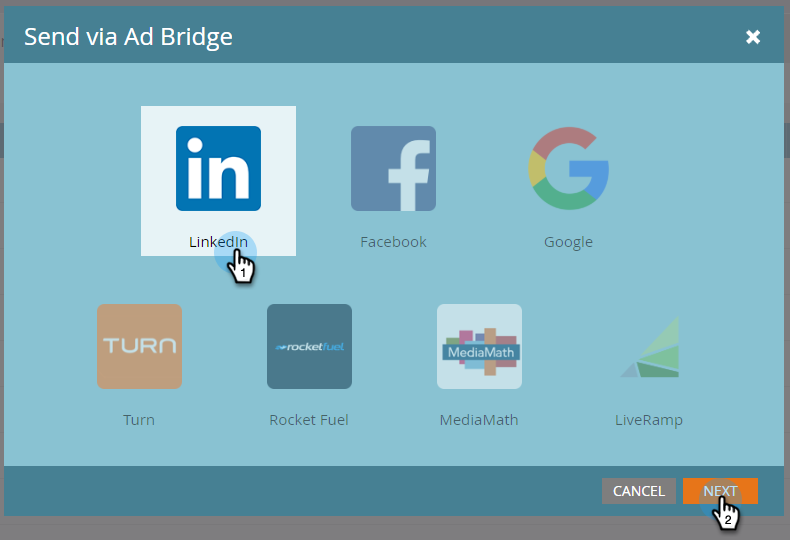

# Créer une Audience mise en correspondance sur LinkedIn {#create-a-matched-audience-on-linkedin}

Créez des audiences correspondantes à partir de vos Listes de compte TAM pour le ciblage publicitaire LinkedIn.

>[!PREREQUISITES]
[Ajouter les Audiences de correspondance LinkedIn en tant que service LaunchPoint](/help/marketo/product-docs/demand-generation/ad-network-integrations/add-linkedin-matched-audiences-as-a-launchpoint-service.md)>
>

1. Dans TAM, cliquez sur l’onglet **Listes de compte**.

   

1. Choisissez la liste de votre compte.

   

1. Cliquez sur la liste déroulante **Actions de Liste de compte** et sélectionnez **Envoyer via AdBridge**.

   

1. Sélectionnez **LinkedIn** et cliquez sur **Suivant**.

   

1. Cliquez sur la liste déroulante **Audience**. Vous pouvez sélectionner une audience existante ou en créer une nouvelle. Dans cet exemple, nous allons en créer une nouvelle (si vous sélectionnez une audience existante, passez à l’étape 7).

   

1. Cliquez sur la liste déroulante **Compte publicitaire** et sélectionnez le compte publicitaire de cible.

   

1. Nommez votre audience et cliquez sur **Mettre à jour**.

   

   Et c&#39;est tout. Votre audience a été envoyée à LinkedIn.

>[!MORELIKETHIS]
[Utilisation d’une Liste Marketo ou d’une Liste dynamique en tant que segment d’Audience LinkedIn](/help/marketo/product-docs/demand-generation/social/social-functions/use-a-marketo-list-or-smart-list-as-a-linkedin-audience-segment.md)
