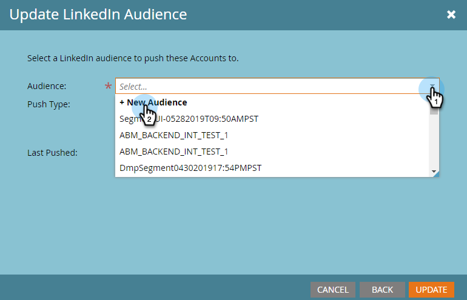

# Création d’une audience mise en correspondance de compte sur LinkedIn {#create-an-account-matched-audience-on-linkedin}

Créez des audiences de correspondance de compte à partir de vos listes de compte TAM pour le [ciblage publicitaire LinkedIn](https://business.linkedin.com/marketing-solutions/ad-targeting/account-targeting). LinkedIn fait correspondre la liste aux comptes de son système et vous pouvez créer une audience LinkedIn basée sur cette liste de comptes à activer sur les canaux LinkedIn. Cela permet aux marketeurs de cibler des personnes dans ou en dehors de leur base de données.

>[!PREREQUISITES]
>
>[Ajout d’audiences mappées LinkedIn en tant que service LaunchPoint](/help/marketo/product-docs/demand-generation/ad-network-integrations/add-linkedin-matched-audiences-as-a-launchpoint-service.md)

1. Dans TAM, cliquez sur l’onglet **Listes de comptes** .

   

1. Sélectionnez la liste de comptes de votre choix.

   

1. Cliquez sur la liste déroulante **Actions de liste de comptes** et sélectionnez **Envoyer via AdBridge**.

   

1. Sélectionnez **LinkedIn** et cliquez sur **Suivant**.

   

1. Cliquez sur la liste déroulante **Audience** . Vous pouvez sélectionner une audience existante ou en créer une nouvelle. Dans cet exemple, nous allons en créer une (si vous sélectionnez une audience existante, passez à l’étape 7).

   

1. Cliquez sur la liste déroulante **Compte publicitaire** et sélectionnez le compte publicitaire cible.

   

1. Nommez votre audience et cliquez sur **Mettre à jour**.

   

Et c&#39;est tout. Votre liste de comptes a été transférée à LinkedIn.

>[!MORELIKETHIS]
>
>[Utilisation d’une liste Marketo ou d’une liste dynamique en tant que segment d’audience LinkedIn](/help/marketo/product-docs/demand-generation/social/social-functions/use-a-marketo-list-or-smart-list-as-a-linkedin-audience-segment.md)
