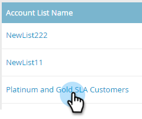
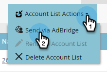

# Création d’une audience avec correspondance de compte sur [!DNL LinkedIn] {#create-an-account-matched-audience-on-linkedin}

Créez des audiences correspondantes dans les listes de comptes de votre gestion des actifs numériques pour le [[!DNL LinkedIn] ciblage publicitaire](https://business.linkedin.com/marketing-solutions/ad-targeting/account-targeting). [!DNL LinkedIn] associera la liste aux comptes de leur système et vous pourrez créer une audience [!DNL LinkedIn] basée sur cette liste de comptes à activer sur [!DNL LinkedIn] canaux. Cela permet aux spécialistes marketing de cibler des personnes dans ou en dehors de leur base de données.

>[!PREREQUISITES]
>
>[Ajout  [!DNL LinkedIn]  audiences correspondantes en tant que service LaunchPoint](/help/marketo/product-docs/demand-generation/ad-network-integrations/add-linkedin-matched-audiences-as-a-launchpoint-service.md)

1. Dans TAM, cliquez sur l’onglet **[!UICONTROL Listes de comptes]**.

   

1. Choisissez la liste de comptes souhaitée.

   

1. Cliquez sur le menu déroulant **[!UICONTROL Actions de liste de compte]** et sélectionnez **[!UICONTROL Envoyer via AdBridge]**.

   

1. Choisissez **[!DNL LinkedIn]** et cliquez sur **[!UICONTROL Suivant]**.

   

1. Cliquez sur la liste déroulante **[!UICONTROL Audience]**. Vous pouvez sélectionner une audience existante ou en créer une nouvelle. Dans cet exemple, nous allons en créer une nouvelle (si vous sélectionnez une audience existante, passez à l’étape 7).

   

1. Cliquez sur le menu déroulant **[!UICONTROL Compte publicitaire]** et sélectionnez le compte publicitaire cible.

   

1. Nommez votre audience et cliquez sur **[!UICONTROL Mettre à jour]**.

   

Et c’est tout. Votre liste de comptes a été transmise à [!DNL LinkedIn].

>[!MORELIKETHIS]
>
>[Utilisation d’une liste Marketo ou d’une liste dynamique en tant que segment  [!DNL LinkedIn] ’audience](/help/marketo/product-docs/demand-generation/social/social-functions/use-a-marketo-list-or-smart-list-as-a-linkedin-audience-segment.md)
