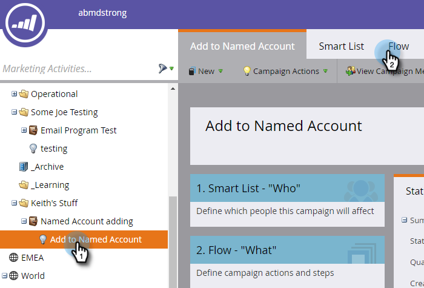
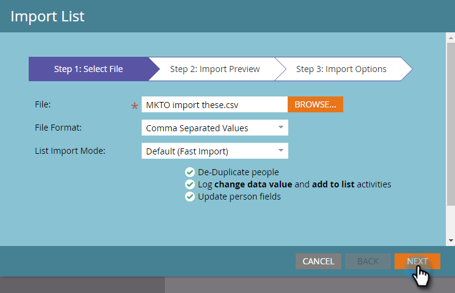

# Ajouter des personnes à un [!UICONTROL Compte nommé] {#add-people-to-a-named-account}

Il existe trois manières différentes d’ajouter manuellement des personnes à un compte nommé dans TAM.

## Action à flux unique {#single-flow-action}

1. Cliquez sur **[!UICONTROL Base de données]**.

   

1. Saisissez l’adresse e-mail de la personne et appuyez sur Entrée.

   

1. Cliquez sur la personne pour la sélectionner. Cliquez sur la liste déroulante **[!UICONTROL Actions de personne]**, cliquez sur **[!UICONTROL Marketing]** et sélectionnez **[!UICONTROL Ajouter au compte nommé...]**.

   

1. Cliquez sur le menu déroulant **[!UICONTROL Compte nommé]**, sélectionnez le [!UICONTROL Compte nommé] souhaité, puis cliquez sur **[!UICONTROL Exécuter maintenant]**.

   

## Étape de flux de campagne intelligente {#smart-campaign-flow-step}

1. Sélectionnez votre campagne intelligente et cliquez sur **[!UICONTROL Flux]**.

   

1. Dans la zone de recherche, saisissez « [!UICONTROL Ajouter au compte nommé] ».

   

1. Faites glisser le filtre sur la zone de travail.

   

1. Cliquez sur le menu déroulant **[!UICONTROL Compte nommé]** et sélectionnez le [!UICONTROL Compte nommé] souhaité.

   

   Vous avez terminé. Il vous suffit ensuite de planifier (ou d’activer) votre campagne intelligente, et l’étape de flux commencera à ajouter des personnes qualifiées au compte nommé désigné.

## Importer une liste {#list-import}

1. Sélectionnez votre liste, cliquez sur le menu déroulant **[!UICONTROL Actions de liste]** et sélectionnez **[!UICONTROL Importer la liste]**.

   

1. Après avoir choisi votre fichier et vos paramètres, cliquez sur **[!UICONTROL Suivant]**.

   

1. Mappez les champs de votre choix. Assurez-vous que le champ **[!UICONTROL Compte nommé]** est mappé.

   

1. Choisissez les paramètres souhaités, puis cliquez sur **[!UICONTROL Importer]**.

   

>[!MORELIKETHIS]
>
>[Correspondance entre les prospects et les comptes](/help/marketo/product-docs/target-account-management/target/named-accounts/lead-to-account-matching.md)
