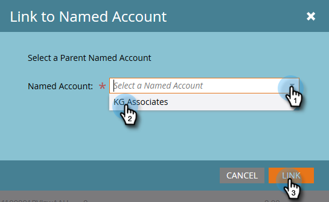

# Créer une hiérarchie {#create-a-hierarchy}

Les hiérarchies sont créées dans les CRM. Toutefois, si vous ne disposez pas d’un CRM, procédez comme suit pour créer une hiérarchie manuellement.

1. Dans [!UICONTROL Comptes nommés], cochez la case **[!UICONTROL Regrouper par hiérarchie]**.

   

   >[!NOTE]
   >
   >Seuls les comptes non CRM peuvent être utilisés pour créer manuellement une hiérarchie. Les hiérarchies des comptes liés au CRM doivent être créées dans le CRM.

1. À l’aide des combinaisons Ctrl+clic (Windows) ou Cmd+clic (Mac), sélectionnez tous les comptes à regrouper dans une hiérarchie.

   

1. Cliquez sur le menu déroulant **[!UICONTROL Actions de compte nommé]** et sélectionnez **[!UICONTROL Lier à un compte nommé]**.

   

   >[!NOTE]
   >
   >Pour annuler le lien d’un compte, procédez comme suit, mais choisissez **[!UICONTROL Annuler le lien d’un compte nommé]**.

1. Sélectionnez un Compte nommé parent dans la liste déroulante, puis cliquez sur **[!UICONTROL Lien]**.

   

1. Vos comptes nommés font désormais partie d’une hiérarchie. Cliquez sur la flèche à gauche pour afficher tous les comptes enfants.

   
