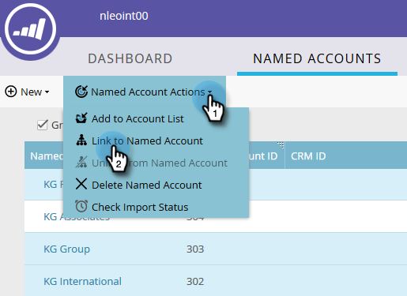

# Création d’une hiérarchie {#create-a-hierarchy}

Les hiérarchies sont destinées à être créées dans les CRM. Toutefois, si vous ne disposez pas d’un CRM, procédez comme suit pour créer une hiérarchie manuellement.

1. Dans Comptes nommés, cochez la case **Regrouper par hiérarchie** .

   

   >[!NOTE]
   >
   >Seuls les comptes non CRM peuvent être utilisés pour créer manuellement une hiérarchie. Les comptes liés au CRM doivent avoir leurs hiérarchies créées dans le CRM.

1. En maintenant la touche ctrl+clic (Windows) ou Cmd+clic (Mac), sélectionnez tous les comptes à regrouper dans une hiérarchie.

   

1. Cliquez sur la liste déroulante **Actions de compte nommé** et sélectionnez **Lien vers le compte nommé**.

   

   >[!NOTE]
   >
   >Si vous souhaitez dissocier des comptes, suivez les étapes ci-dessus, mais choisissez **Rompre le lien du compte nommé**.

1. Sélectionnez un compte nommé parent dans la liste déroulante et cliquez sur **Lien**.

   

1. Les comptes nommés font désormais partie d’une hiérarchie. Cliquez sur la flèche située à gauche pour afficher tous ses comptes enfants.

   
