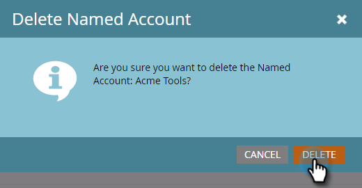

# Supprimer un [!UICONTROL compte nommé] {#delete-a-named-account}

Pour supprimer un compte nommé, procédez comme suit.

1. Sélectionnez la ligne du ou des comptes nommés à supprimer.

   

   >[!NOTE]
   >
   >Pour sélectionner plusieurs comptes nommés, utilisez la combinaison de touches Ctrl+clic (Windows) ou Cmd+clic (Mac).

1. Cliquez sur le menu déroulant **[!UICONTROL Actions de compte nommé]** et sélectionnez **[!UICONTROL Supprimer le compte nommé]**.

   

1. Cliquez sur **[!UICONTROL Supprimer]**.

   

   >[!NOTE]
   >
   >Les comptes synchronisés avec votre CRM ne peuvent pas être supprimés dans TAM. Si l’option de suppression n’est pas disponible, ou si vous recevez un message « Ces comptes ne peuvent pas être supprimés car un ou plusieurs comptes CRM sont sélectionnés », ils doivent être supprimés directement dans le CRM.
