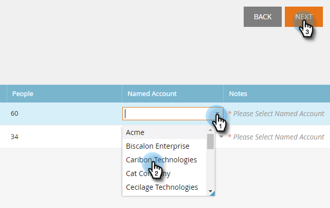

# Découvrir les comptes {#discover-accounts}

Utilisez l’option Découvrir pour identifier les comptes cibles potentiels.

## Découvrir les comptes CRM {#discover-crm-accounts}

Identifiez les comptes cibles potentiels à partir de votre CRM.

>[!NOTE]
>
>Une fois que vous avez connecté votre CRM à Marketo TAM, **Découvrir les comptes CRM** affiche tous les comptes CRM et les informations pertinentes pour vous aider à choisir les comptes nommés appropriés. Marketo ajoute des informations supplémentaires en plus de celles reçues du CRM.

**Personnes** (dans Comptes CRM Discover et Sociétés Marketo Discover) : inclut les contacts et les prospects. Les prospects peuvent être découverts à l’aide du Marketo [correspondance entre les prospects et les comptes](/help/marketo/product-docs/target-account-management/target/named-accounts/lead-to-account-matching.md).

**Personnes potentielles** (dans Comptes CRM Discover et Sociétés Marketo Discover) : indique le nombre de prospects Marketo trouvés qui pourraient appartenir à un compte CRM.

**Champ CRM personnalisé** (dans Comptes Discover CRM uniquement) : cela vous aidera à aligner votre organisation des ventes et votre organisation marketing pour la sélection des comptes cibles appropriés. Une fois que vous [mappez le champ CRM personnalisé](/help/marketo/product-docs/target-account-management/setup-tam/create-a-custom-field-for-crm-discovery.md) avec la gestion de la relation client Marketo, nous vous montrerons les données mappées pour vous aider à identifier vos comptes cibles.

1. Dans Comptes nommés, cliquez sur la liste déroulante **Nouveau** et sélectionnez **Découvrir les comptes CRM**.

   

1. Une nouvelle fenêtre/un nouvel onglet s’ouvre. Sélectionnez le ou les comptes CRM à ajouter à vos comptes nommés et cliquez sur **Suivant**.

   

1. L’écran de prévisualisation confirme le nombre de sélections. Cliquez sur **Créer**.

   

   C&#39;est tout !

   

## Découvrir les sociétés Marketo {#discover-marketo-companies}

Identifiez les entreprises appropriées pour le ciblage.

>[!NOTE]
>
>Dans Découvrez les sociétés Marketo, vous verrez les sociétés Marketo qui ne proviennent pas de votre CRM.

1. Dans Comptes nommés, cliquez sur la liste déroulante **Nouveau** et sélectionnez **Découvrir les sociétés Marketo**.

   

1. Une nouvelle fenêtre/un nouvel onglet s’ouvre. Sélectionnez les sociétés à ajouter à vos comptes nommés et cliquez sur **Suivant**.

   

   >[!NOTE]
   >
   >Dans Discover Marketo Companies et Discover CRM, Marketo s’exécute automatiquement :
   >
   >* Recherche les personnes de votre base de données Marketo dont l’entreprise est répertoriée dans leur enregistrement. Si vous voyez plusieurs valeurs pour certains attributs (par exemple, Secteur), c’est parce que Marketo a trouvé différentes valeurs répertoriées pour ces personnes individuelles. L’attribut qui a le plus d’accès gagne
   >
   >Dans **Discover CRM** uniquement, Marketo automatiquement :
   >
   >* Synchronise et associe les contacts CRM au compte nommé
   >
   >Dans **Discover Marketo Companies** uniquement, Marketo s’affiche automatiquement :
   >
   >* Filtre la plupart des fournisseurs de services Internet et des domaines publics (par exemple, yahoo.com, gmail.com) comme noms de société
   >
   >* Déduplique les comptes CRM Si vous avez « Acme » dans un enregistrement et « Acme Inc » (ou l&#39;un des suffixes suivants : Co, Corp, Corporation, Gmbh, Inc, Incorporated, LLC, LLP, LP, Ltd, PA, PC, PLC, PLLC), nous les fusionnerons dans TAM comme simplement « Acme »

1. Cliquez sur la flèche vers le bas située sous la colonne Compte nommé pour afficher la liste déroulante.

   

   >[!CAUTION]
   >
   >À l’avenir, toutes les nouvelles personnes de ces sociétés sélectionnées seront automatiquement affectées à leurs comptes nommés respectifs. Veuillez revérifier ces sociétés et vous assurer qu&#39;elles sont affectées au compte nommé approprié.

1. Pour sélectionner un compte existant, cliquez sur le menu déroulant **Compte nommé**, choisissez le compte souhaité, puis cliquez sur **Suivant**.

   

   Vous avez également la possibilité de créer un compte nommé en saisissant directement le nom souhaité dans la liste déroulante. Cliquer en dehors de la zone une fois terminé...

   

   ...et votre nouveau compte nommé s’affichera. À ce stade, cliquez simplement sur **Suivant** comme à l’étape 4.

   

1. Cliquez sur **Créer**.

   

   Beau travail !

   

>[!NOTE]
>
>Si vous constatez une incohérence entre les comptes CRM que vous avez sélectionnés et le contenu de la grille Discover CRM, elle est probablement due à un ou plusieurs des éléments suivants :
>
>* Disposer de comptes CRM différents avec des noms similaires qui ont été dédupliqués
>* La prochaine synchronisation planifiée n’a pas encore eu lieu

>[!MORELIKETHIS]
>
>[Correspondance entre les prospects et les comptes](/help/marketo/product-docs/target-account-management/target/named-accounts/lead-to-account-matching.md)
