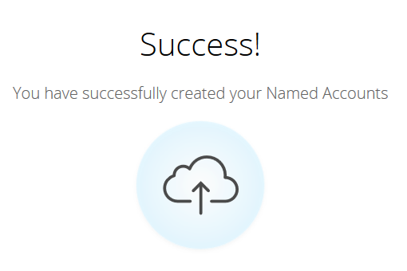

# Découverte des comptes {#discover-accounts}

Utilisez l’option Discover pour identifier les comptes cibles potentiels.

## Découvrir les comptes CRM {#discover-crm-accounts}

Identifiez les comptes cibles potentiels à partir de votre CRM.

>[!NOTE]
>
>Une fois que vous avez connecté la gestion de la relation client à Marketo TAM, les **comptes de gestion de la relation client Discover** affichent tous les comptes de gestion de la relation client et les informations pertinentes pour vous aider à choisir les comptes nommés appropriés. Marketo ajoute des informations supplémentaires sur ce qui est reçu du CRM.

**Personnes** (Dans les comptes CRM Discover et les entreprises Marketo Discover) : comprend à la fois des contacts et des prospects. Les pistes peuvent être découvertes à l’aide de la [correspondance de piste vers compte](/help/marketo/product-docs/target-account-management/target/named-accounts/lead-to-account-matching.md) de Marketo.

**Personnes potentielles** (Dans les comptes CRM de Discover et les entreprises Marketo de Discover) : indique le nombre de pistes trouvées par Marketo et susceptibles d’appartenir à un compte CRM.

**Champ CRM personnalisé** (dans les comptes CRM Discover uniquement) : vous permettra d’aligner votre organisation commerciale et marketing sur la sélection des comptes cibles corrects. Une fois que vous aurez [mappé le champ CRM personnalisé](/help/marketo/product-docs/target-account-management/setup-tam/create-a-custom-field-for-crm-discovery.md) avec Marketo TAM, nous vous montrerons les données mappées pour vous aider à identifier vos comptes cibles.

1. Dans Comptes nommés, cliquez sur la liste déroulante **Nouveau** et sélectionnez **Comptes CRM Discover**.

   

1. Une nouvelle fenêtre ou un nouvel onglet s’ouvre. Sélectionnez le ou les comptes CRM que vous souhaitez ajouter à vos comptes nommés et cliquez sur **Suivant**.

   

1. L’écran de prévisualisation confirme le nombre de sélections. Cliquez sur **Créer**.

   

   C&#39;est tout ce qu&#39;il y a à ça !

   

## Découvrir les sociétés Marketo {#discover-marketo-companies}

Identifiez les bonnes entreprises pour le ciblage.

>[!NOTE]
>
>Dans les sociétés Discover Marketo, vous verrez les sociétés Marketo qui ne proviennent pas de votre système de gestion de la relation client.

1. Dans Comptes nommés, cliquez sur la liste déroulante **Nouveau** et sélectionnez **Discover Marketo Entreprises**.

   

1. Une nouvelle fenêtre ou un nouvel onglet s’ouvre. Sélectionnez les sociétés à ajouter à vos comptes nommés et cliquez sur **Suivant**.

   

   >[!NOTE]
   >
   >Dans les entreprises Discover Marketo et Discover CRM, Marketo automatiquement :
   >
   >* Recherche les personnes de votre base de données Marketo dont l’entreprise est répertoriée dans leur enregistrement. Si plusieurs valeurs s’affichent pour certains attributs (secteur, par exemple), c’est parce que Marketo a trouvé des valeurs différentes répertoriées pour ces personnes. L’attribut avec le plus d’accès gagne
   >
   >Dans **Discover CRM** uniquement, Marketo automatiquement :
   >
   >* Synchronise et associe les contacts CRM au compte nommé
   >
   >Dans les **sociétés Discover Marketo** uniquement, Marketo automatiquement :
   >
   >* Filtre la plupart des fournisseurs de services Internet et des domaines publics (par exemple, yahoo.com, gmail.com) comme noms d’entreprise.
   >
   >* déduplique les comptes CRM. Si vous avez &quot;Acme&quot; dans un enregistrement et &quot;Acme Inc&quot; (ou l’un des suffixes suivants : Co, Corp, Corporation, Gmbh, Inc, Incorporated, LLC, LLP, LP, Ltd, PA, PC, PLC, PLLC), nous les fusionnerons dans TAM en tant que simplement &quot;Acme&quot;.
   >
   >Si vous souhaitez que Marketo déduplique les comptes par identifiant CRM ou propriétaire de compte au lieu de par nom de société, contactez le [support Marketo](https://nation.marketo.com/t5/Support/ct-p/Support).

1. Cliquez sur la flèche vers le bas située sous la colonne Compte nommé pour afficher le menu déroulant.

   

   >[!CAUTION]
   >
   >Dorénavant, toutes les nouvelles personnes issues de ces sociétés sélectionnées seront automatiquement affectées à leurs comptes nommés respectifs. Vérifiez deux fois ces sociétés et assurez-vous qu’elles sont affectées au compte nommé approprié.

1. Pour sélectionner un compte existant, cliquez sur la liste déroulante **Compte nommé**, sélectionnez le compte de votre choix, puis cliquez sur **Suivant**.

   

   Vous avez également la possibilité de créer un compte nommé en saisissant directement le nom de votre choix dans la liste déroulante. Lorsque vous avez terminé, cliquez en dehors de la zone...

   

   ...et vous verrez votre nouveau compte nommé. À ce stade, cliquez simplement sur **Suivant** comme à l’étape 4.

   

1. Cliquez sur **Créer**.

   

   Beau travail !

   

>[!NOTE]
>
>Si vous constatez une incohérence entre les comptes CRM que vous avez sélectionnés et ce qui se trouve dans la grille CRM Discover, cela est probablement dû à l’une ou plusieurs des raisons suivantes :
>
>* Disposer de différents comptes CRM avec des noms similaires dédoublonnés
>* La synchronisation planifiée suivante ne s’est pas encore produite

>[!MORELIKETHIS]
>
>[ Atteindre des correspondances de comptes ](/help/marketo/product-docs/target-account-management/target/named-accounts/lead-to-account-matching.md)
