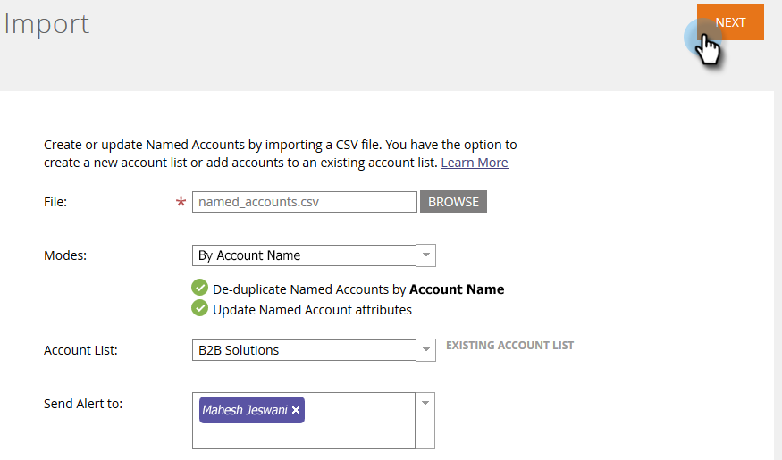

# Importer [!UICONTROL Comptes Nommés] {#import-named-accounts}

Vous avez déjà un fichier CSV rempli de comptes cibles potentiels ? Importez-les directement dans TAM !

1. Cliquez sur la liste déroulante **[!UICONTROL Nouveau]** et sélectionnez **[!UICONTROL Importer des comptes nommés]**.

   

1. Une nouvelle fenêtre s’ouvre. Cliquez sur **[!UICONTROL Parcourir]**, puis sélectionnez le fichier des comptes nommés à importer.

   

   >[!TIP]
   >
   >Dans votre fichier, fournissez [autant d’informations que possible](/help/marketo/product-docs/target-account-management/target/named-accounts/named-account-overview.md#named-account-attributes). Vous pouvez uniquement ajouter des informations démographiques ; rien n’est calculé par Marketo (pipeline, par exemple). Pour créer des comptes nommés en fonction de comptes CRM, il vous suffit d’exporter le nom du compte et l’identifiant CRM de votre CRM dans un fichier CSV, d’utiliser l’option Nom du compte et de mapper l’identifiant CRM lors du processus d’importation. Pour lier correctement un compte CRM à un compte nommé, vous devez fournir le nom exact du compte CRM.

1. Choisissez entre deux modes de déduplication : nom du compte ou nom de domaine. Dans cet exemple, nous choisirons Compte . Cliquez sur la liste déroulante **[!UICONTROL Modes]** et sélectionnez **[!UICONTROL Par nom de compte]**.

   

   >[!NOTE]
   >
   >Si vous choisissez **[!UICONTROL Par nom de domaine]**, les champs Compte nommé et Domaine doivent être inclus.

1. Pour choisir la liste de comptes à laquelle votre compte nommé est ajouté, cliquez sur le menu déroulant **[!UICONTROL Liste de comptes]** et effectuez votre sélection.

   

   >[!NOTE]
   >
   >Vous pouvez également créer une toute nouvelle [!UICONTROL Liste de comptes] en saisissant simplement son nom dans la liste déroulante.

1. Pour envoyer une notification de l’importation, cliquez sur le menu déroulant **[!UICONTROL Envoyer l’alerte à]** et sélectionnez un utilisateur Marketo. Vous _pouvez pas_ saisir manuellement une adresse e-mail.

   

1. Cliquez sur **[!UICONTROL Suivant]**.

   

1. Mappez chaque champ en double-cliquant sur la liste déroulante **[!UICONTROL Champ Marketo]** et en sélectionnant le champ approprié. Cliquez sur **[!UICONTROL Suivant]** lorsque vous avez terminé.

   

   Succès!

   

   >[!NOTE]
   >
   >« Vérifier le statut d’importation » affiche uniquement les trois derniers jours d’activité.

Scénarios de déduplication [!UICONTROL par nom de compte] :

<table>
 <tbody>
  <tr>
   <td><strong>Importation d'un enregistrement avec le nom Compte nommé existant</strong></td>
   <td>
Nous mettrons à jour l’enregistrement existant
</td>
  </tr>
  <tr>
   <td><strong>Import de l'enregistrement avec le nouveau nom Compte nommé</strong></td>
   <td>Nous allons créer un nouvel enregistrement</td>
  </tr>
 </tbody>
</table>

Scénarios de déduplication [!UICONTROL par nom de domaine] :

<table>
 <tbody>
  <tr>
   <td><strong>Importation d'un enregistrement avec un nouveau nom de compte et un nouveau nom de domaine</strong></td>
   <td>Nous allons créer un nouveau Compte nommé avec les informations fournies</td>
  </tr>
  <tr>
   <td><strong>Importation d'un enregistrement avec un nom de compte et un nom de domaine existants</strong></td>
   <td>Nous mettrons à jour le Compte nommé existant</td>
  </tr>
   <tr>
   <td><strong>Importation d'un enregistrement avec un nouveau nom de compte et un nom de domaine existant</strong></td>
   <td>Nous ajouterons le nouveau nom de compte au Compte nommé existant qui correspond au nom de domaine et mettrons à jour d’autres informations (à savoir, secteur, État, etc.)</td>
  </tr>
  <tr>
   <td><strong>Importation d’un enregistrement avec le nom Compte nommé existant et le nouveau nom de domaine</strong></td>
   <td>Nous ajouterons le nouveau nom de domaine au Compte nommé existant qui correspond au nom du compte et mettrons à jour d’autres informations (à savoir, secteur, État, etc.)</td>
  </tr>
 </tbody>
</table>

>[!NOTE]
>
>Lorsque Marketo ajoute un compte nommé, nous mettons à jour une règle (en coulisses) qui nous permet d’identifier les personnes qui doivent faire partie du [!UICONTROL compte nommé]. Exemple : si vous mettez à jour « IBM » sur « IBM, USA », les personnes dont le nom de société est modifié sont associées au [!UICONTROL Compte nommé].

Si Marketo trouve des enregistrements que nous voyons comme des doublons, nous ne traiterons que le premier.
