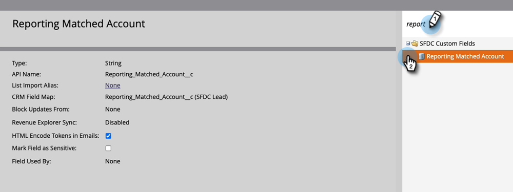

# Correspondance entre les leads et les comptes {#lead-to-account-matching}

Associez les prospects à droite aux comptes nommés à l’aide de la correspondance entre les prospects et les comptes Marketo.

>[!NOTE]
>
>La **correspondance entre les prospects et les comptes** est une fonctionnalité intégrée de Marketo [!UICONTROL gestion des comptes Target]. Il utilise une logique floue pour faire correspondre automatiquement les prospects aux comptes nommés appropriés en temps quasi réel. Ces comptes nommés peuvent être des comptes CRM ou des sociétés Marketo.

## Vue d’ensemble {#overview}

La correspondance entre les leads et les comptes Marketo suit un processus en 4 étapes :

**Étape 1 -** Notre processus de rapprochement commence par l&#39;utilisation d&#39;informations clés sur les enregistrements de leads, telles que :

* Domaine d’e-mail (par exemple, acme.com)
* Nom de société déduit de l’adresse IP
* Nom de la société - Il peut s’agir du nom du compte CRM ou de l’attribut du nom de la société du prospect (provenant, par exemple, du remplissage du formulaire).

**Étape 2 -** Nous normalisons les noms de sociétés que nous trouvons en fonction de divers attributs de prospect (par exemple, Acme Inc. et Acme Corp sont automatiquement normalisés en Acme). Cette étape permet de s’assurer que nous disposons d’une représentation unique du compte nommé dans Marketo et que nous pouvons voir tous les prospects au sein d’un seul compte nommé.

**Étape 3 -** Nous partitionnons les leads appariés en 2 compartiments : correspondance forte et correspondance faible.

* Des prospects faiblement appariés apparaissent sur les comptes nommés, qui peuvent ensuite être résolus manuellement.

**Étape 4 -** Nous présentons une liste des entreprises proposées avec des matchs forts et faibles. Lorsqu’un compte nommé est créé en fonction de l’une des sociétés proposées, nous créons des règles de correspondance pour associer automatiquement de nouveaux prospects (par exemple, un prospect ayant rempli un formulaire) à partir des comptes nommés appropriés. Ainsi, vous pouvez moins vous soucier de la correspondance des prospects et plus de l’obtention du chiffre d’affaires !

Étant donné que la correspondance entre les prospects et les comptes Marketo est une fonctionnalité intégrée de Marketo [!UICONTROL Gestion des comptes Target], la correspondance entre les prospects et les comptes s’effectue en temps quasi réel (par exemple, au moment où un prospect remplit un formulaire Marketo, nous associons ledit prospect au compte nommé approprié). Cet événement peut être utilisé pour déclencher des alertes et informer les propriétaires de compte des nouveaux prospects provenant de leurs comptes nommés.

>[!NOTE]
>
>Si vous utilisez LeanData dans Salesforce pour effectuer une correspondance entre les prospects et les comptes, Marketo dispose d’une intégration qui synchronise ces correspondances avec votre instance Marketo. Pour activer cette fonctionnalité, contactez l’assistance technique de [Marketo](https://nation.marketo.com/t5/Support/ct-p/Support) Découvrez comment configurer LeanData ci-dessous.

## Utilisation de données complètes pour la correspondance des prospects et des comptes {#using-leandata-for-lead-to-account-matching}

Une fois que la prise en charge de [Marketo](https://nation.marketo.com/t5/Support/ct-p/Support) a activé LeanData pour votre compte, suivez les étapes ci-dessous pour le configurer.

1. Dans Salesforce, cliquez sur **[!UICONTROL Configurer l’accueil]** dans le volet de navigation de gauche.

1. Toujours dans le volet de navigation de gauche, sous Administration, cliquez sur **[!UICONTROL Utilisateurs]** puis **[!UICONTROL Profils]**.

1. Recherchez et sélectionnez le profil **Marketo Sync**.

1. Faites défiler l’écran jusqu’à la section Sécurité au niveau du champ et recherchez l’objet de lead. Sélectionnez **[!UICONTROL Afficher]**.

1. Pour le nom de champ « Compte de rapport correspondant », assurez-vous que la case à cocher de la colonne **[!UICONTROL Accès en lecture]** est sélectionnée.

1. Dans Marketo, accédez à la section **[!UICONTROL Admin]**.

   

1. Sélectionnez **[!UICONTROL Gestion des champs]**.

   

1. Vérifiez que le champ s’y trouve en recherchant « [!UICONTROL Compte de reporting correspondant] ».

   

>[!MORELIKETHIS]
>
>[Découvrir les comptes](/help/marketo/product-docs/target-account-management/target/named-accounts/discover-accounts.md)
