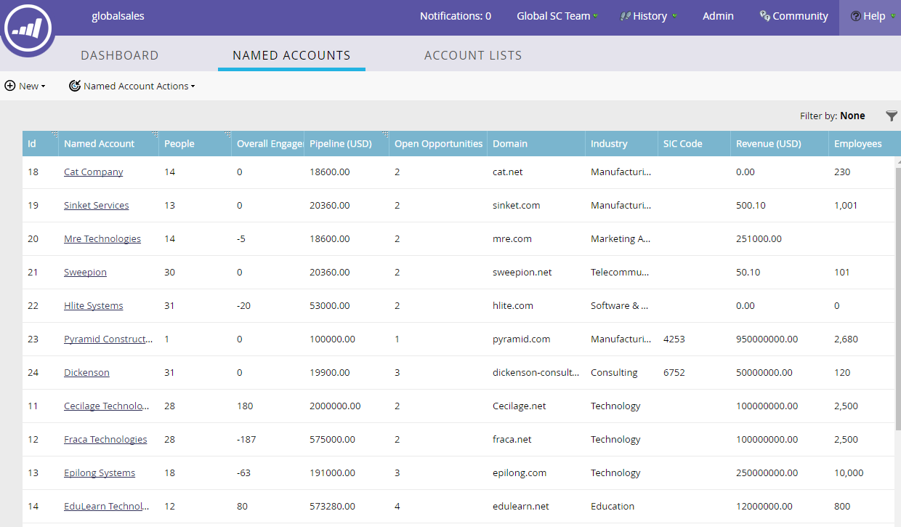

# Présentation du [!UICONTROL Compte nommé] {#named-account-overview}

[!UICONTROL Comptes nommés] conservez les personnes des sociétés que vous ciblez. Le tableau de bord fournit des données actuelles sur chaque attribut pour tous vos comptes nommés.

## [!UICONTROL Comptes nommés] tableau de bord {#named-accounts-dashboard}

>[!TIP]
>
>Les comptes nommés sont triés par défaut en fonction de la date de création. Vous pouvez toutefois les trier selon n’importe quelle colonne dont l’en-tête contient une icône de tri.

>[!NOTE]
>
>Marketo affiche tous les utilisateurs CRM synchronisés dans Marketo en tant que valeurs de filtre de « Propriétaire du compte » ou « Membre de l’équipe du compte ».

## Attributs [!UICONTROL Compte Nommé] {#named-account-attributes}

<table>
 <tbody>
  <tr>
   <td><strong>ID</strong></td>
   <td>Numéro d’identification du compte nommé</td>
  </tr>
  <tr>
   <td><strong>Compte nommé</strong></td>
   <td>Nom du compte nommé</td>
  </tr>
  <tr>
   <td><strong>Personnes</strong></td>
   <td>Nombre de personnes attribuées au compte nommé</td>
  </tr>
  <tr>
   <td><strong>Pipeline</strong></td>
   <td>Somme de toutes les opportunités de votre système CRM qui ne sont ni closes et confirmées ni closes et perdues.</td>
  </tr>
  <tr>
   <td><strong>Opportunités ouvertes</strong></td>
   <td>Toutes les opportunités de votre CRM qui ne sont pas closes et confirmées ou closes et perdues.</td>
  </tr>
  <tr>
   <td><strong>Domaine</strong></td>
   <td>Domaine du compte nommé (par exemple, marketo.com)</td>
  </tr>
  <tr>
   <td><strong>Secteur industriel</strong></td>
   <td>Type de secteur attribué au compte nommé</td>
  </tr>
  <tr>
   <td><strong>Code SIC</strong></td>
   <td><strong>S</strong>standard <strong>I</strong>industriel <strong>C</strong>classification - code à quatre chiffres pour la classification des industries </td>
  </tr>
  <tr>
   <td><strong>Recettes</strong></td>
   <td>Chiffre d'affaires annuel de l'entreprise</td>
  </tr>
  <tr>
   <td><strong>Employés</strong></td>
   <td>Nombre d'employés attribués à un compte nommé</td>
  </tr>
  <tr>
   <td colspan="1"><strong>Évaluation du compte</strong></td>
   <td colspan="1">Agrégat de scores de leads provenant de plusieurs leads pour fournir le score au niveau du compte</td>
  </tr>
  <tr>
   <td colspan="1"><strong>Ville</strong></td>
   <td colspan="1">Ville du compte nommé</td>
  </tr>
  <tr>
   <td colspan="1"><strong>État/région</strong></td>
   <td colspan="1">État ou région du compte nommé</td>
  </tr>
  <tr>
   <td colspan="1"><strong>Pays</strong></td>
   <td colspan="1">Pays du compte nommé</td>
  </tr>
  <tr>
   <td colspan="1"><strong>Date de création</strong></td>
   <td colspan="1">Date de création du compte nommé</td>
  </tr>
  <tr>
   <td colspan="1"><strong>Détenteur du compte</strong></td>
   <td colspan="1">Propriétaire du compte spécifié</td>
  </tr>
  <tr>
   <td colspan="1"><strong>Membres de l’équipe responsable du compte</strong></td>
   <td colspan="1">Membre du groupe des parties prenantes qui travaillent ensemble sur des comptes spécifiques</td>
  </tr>
 </tbody>
</table>
