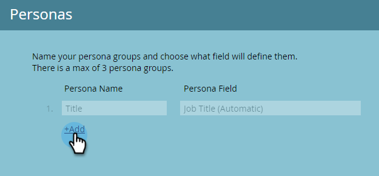
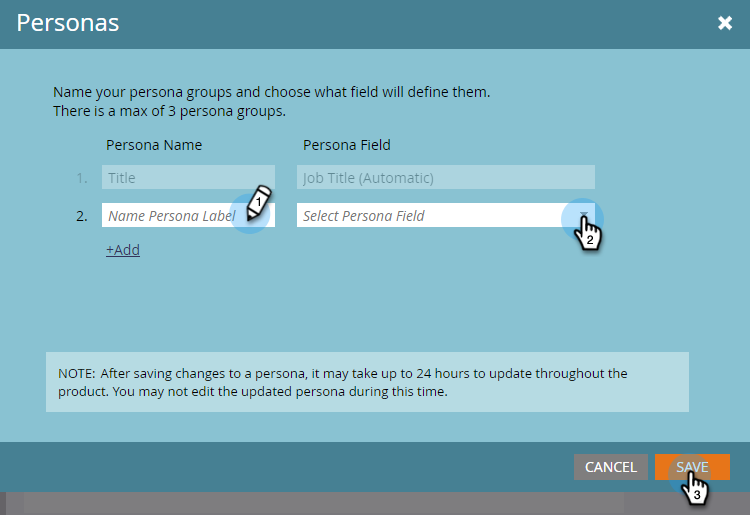

# Utilisation des personnages {#using-personas}

Les personas sont un excellent moyen de segmenter votre audience et votre marché ABM en un sous-ensemble spécifique de personnes.

## Ajouter un personnage {#add-a-persona}

1. Dans Mon Marketo, cliquez sur **Admin**.

   

1. Dans l’arborescence, sélectionnez **Gestion de compte Target**.

   

1. Cliquez sur **Modifier**.

   

   >[!NOTE]
   >
   >Le personnage du titre de la tâche est inclus par défaut. Il ne peut pas être modifié ni supprimé.

1. Pour ajouter d’autres personnages, cliquez sur **+Ajouter**.

   

1. Donnez un nom à votre persona et sélectionnez le champ correspondant dans la liste déroulante. Vous pouvez ajouter jusqu’à deux personnages supplémentaires. Cliquez sur **Enregistrer** lorsque vous avez terminé.

   

   >[!NOTE]
   >
   >Seuls les champs personnalisés Salesforce de type &quot;liste de sélection&quot; synchronisés avec votre instance Marketo sont disponibles dans la liste déroulante des champs de persona lors de la création d’une persona.

## Affichage de vos personnages {#view-your-personas}

Affichez vos personnages en consultant un compte nommé spécifique.

1. Sélectionnez un compte nommé.

   

1. Cliquez sur l’onglet **Personas** .

   

1. Toutes vos personas sont répertoriées. Cliquez sur un nombre pour afficher la liste des personnes.

   

   >[!NOTE]
   >
   >Le X dans le Titre Persona agit comme un caractère générique. Par exemple, &quot;CXO&quot; inclura les PDG, les directeurs financiers, etc.

## Filtres de personnalisation {#persona-filters}

1. Utilisez des filtres de personnage dans une liste dynamique pour les commercialiser auprès d’un groupe spécifique de personnes.

