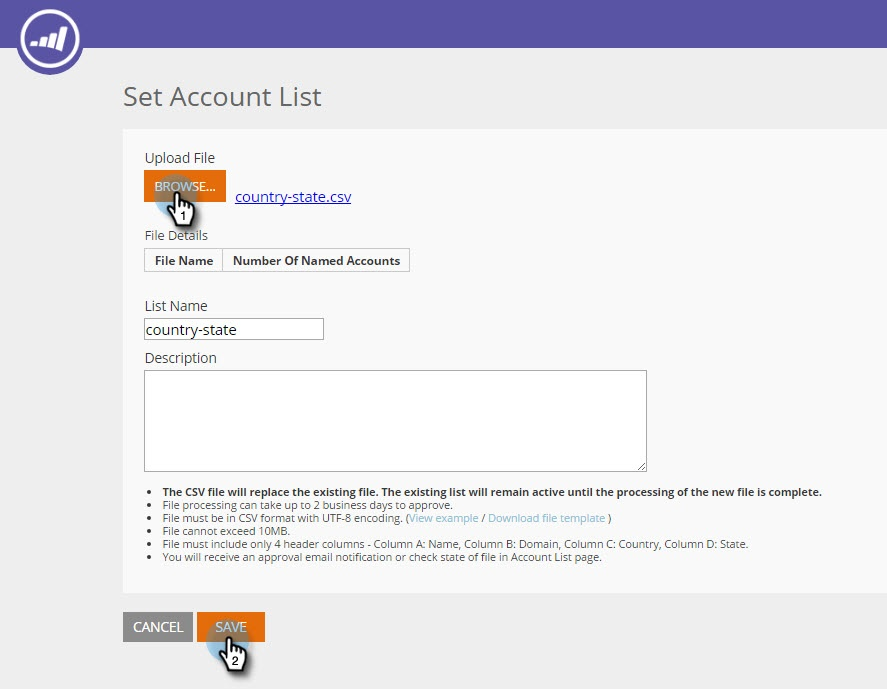
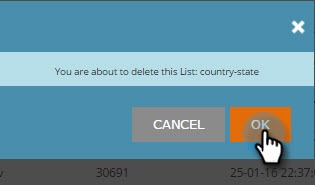

# Créer une Liste de compte {#create-a-new-account-list}

Créez et téléchargez une liste de noms d’organisation et de domaine pour cible de ces comptes clés avec des campagnes personnalisées.

>[!NOTE]
>
>Cet article s&#39;applique uniquement aux clients Web ABM hérités. Si vous avez acquis Web ABM après septembre 2016, suivez plutôt les étapes de [cet article](http://docs.marketo.com/display/DOCS/Account+Lists#AccountLists-CreateaNewAccountList) .

## Créer une Liste de compte {#create-a-new-account-list-1}

1. Accédez à Listes **** de compte.

   

1. Sélectionnez **Créer nouveau**.

   

1. Sélectionnez **Parcourir** et téléchargez votre fichier CSV (assurez-vous que le fichier CSV répond aux critères). Ajoutez un **nom** et une **description**. Cliquez sur **Enregistrer**.

   

   >[!NOTE]
   >
   >**Quel est le format du fichier CSV ?**
   >
   >
   >Assurez-vous que le fichier CSV du compte nommé respecte les exigences suivantes :
   >
   >* Enregistré au format CSV
   >* Ne dépasse pas 10 Mo
   >* Seulement 4 colonnes avec l&#39;en-tête Colonne A : Nom, colonne B : Domaine, colonne C : Pays, colonne D : Etat américain.
   >* Le téléchargement d’un fichier peut prendre jusqu’à 2 jours ouvrés avant l’approbation.
   >* Vous recevrez une notification par courrier électronique d’approbation ou vérifiez l’état du fichier dans la page Comptes nommés.
   >* Nombre total d&#39;enregistrements/lignes cumulés pour toutes vos listes téléchargées sur débuts à 10 000, le plus grand package totalisant 100 000.

   >[!NOTE]
   >
   >**Exemple**
   >
   >**Exemple de fichier CSV**
   >
   >* Ligne 1 Colonne A Valeur = Organisation
   >* Ligne 1 Valeur de colonne B = Domaine
   >* Ligne 1 Valeur de colonne C = Pays
   >* Ligne 1 Colonne D Valeur = État des États-Unis
   >* L’une des valeurs de colonne est obligatoire. Toutefois, le fait de fournir les noms d’organisation et de domaine améliore les taux de correspondance de la Liste de comptes.
   >* Le pays et l’état sont des valeurs facultatives.

      >
      >  
   * Pour le nom du pays, utilisez le nom complet du pays ou le code d’abréviation. Par ex. États-Unis ou États-Unis.
   >  * Pour un État des États-Unis, utilisez le code d’abréviation à deux lettres, c’est-à-dire CA. Seuls les États américains sont reconnus.

   >    
   >

## Modifier une Liste de compte {#edit-an-account-list}

Sur la page Listes **du** compte, cliquez sur l’icône **Modifier **sur la liste.

Sélectionnez **Parcourir** et téléchargez votre nouveau fichier CSV. Ce fichier remplacera le fichier d&#39;origine. Cliquez sur **Enregistrer**. Le nouveau fichier téléchargé sera dans l’état en attente jusqu’à ce qu’il soit approuvé par le service d’assistance marketing, alors que dans l’état en attente, le fichier d’origine restera principal.

Le fichier CSV remplace le fichier existant. La liste existante restera principale jusqu&#39;à ce que le traitement du nouveau fichier soit terminé.

## Suppression d’une Liste de compte nommée {#delete-a-named-account-list}

1. Sur la page **Listes de compte **, cliquez sur l&#39;icône **Supprimer **de la liste à supprimer.

   

1. Un message s’affiche pour confirmer si vous souhaitez supprimer la liste. Cliquez sur **OK**.

   

>[!NOTE]
>
>**Articles connexes**
>
>* [Création d’un segment à l’aide d’une Liste de compte](create-a-segment-using-an-account-list.md)
>* [Vue d&#39;une Liste de compte nommée](http://docs.marketo.com/pages/viewpage.action?pageid=4720244)

