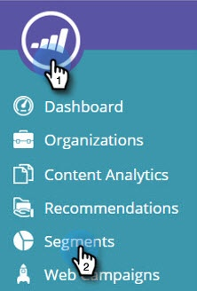

# Créer un segment à l’aide d’une liste de comptes {#create-a-segment-using-an-account-list}

Voici comment créer un segment à l’aide d’une liste de comptes.

>[!PREREQUISITES]
>
>[Créer une liste de comptes](/help/marketo/product-docs/target-account-management/target/account-lists.md)

1. Accédez à **[!UICONTROL Segments]**.

   

1. Cliquez sur **[!UICONTROL Créer]**.

   

1. Saisissez un nom pour le segment. Effectuez un glisser-déposer **[!UICONTROL Listes de comptes]** depuis la section **[!UICONTROL Firmographics]**.

   

1. Sélectionnez une liste de comptes dans la liste des comptes nommés que vous avez chargés. Le nombre entre crochets en regard de Nom de la liste de comptes est l’identifiant de la liste pour la référence à l’API.

   

   >[!NOTE]
   >
   >Les listes de comptes sont synchronisées d’ABM à Web Personalization pour une utilisation dans la segmentation. Sélectionnez-les dans la liste déroulante. La synchronisation peut prendre jusqu’à cinq minutes. Elle ne se synchronise que s’il existe un ou plusieurs comptes nommés dans la liste des comptes.

1. Cliquez sur **[!UICONTROL Enregistrer]** ou sur **[!UICONTROL Enregistrer et définir la campagne]** pour accéder à la page Campagnes .

   

Félicitations ! Vous avez maintenant configuré un segment ciblant une liste de comptes.
