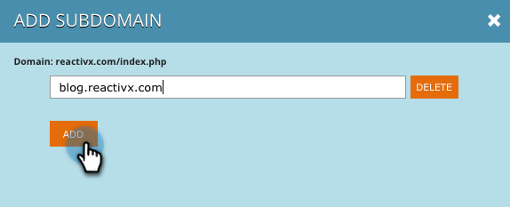
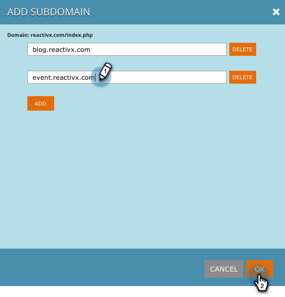

# Ajouter des sous-domaines dans les paramètres du compte {#add-subdomains-in-account-settings}

Voici comment ajouter des sous-domaines à vos Principaux domaines dans Paramètres du compte. Cela vous permettra de gérer les sous-domaines liés au script JavaScript RTP spécifique de votre Principal domaine. Il est recommandé de déployer la balise Javascript sur tous les sous-domaines ajoutés.

1. Dans Personnalisation Web, accédez à Paramètres **du** compte.

   

1. Sur la page Configuration du domaine, vous verrez une liste de tous les domaines Principaux associés à votre compte. Chaque section liste d’abord le domaine Principal (mis en évidence ci-dessous), puis tous les sous-domaines. Cliquez sur **Ajouter un sous-domaine**.

   

1. Cliquez sur **Ajouter**.

   

1. Entrez l’URL du sous-domaine. Cliquez sur **Ajouter** ou **Supprimer** pour gérer votre liste de sous-domaines, puis sur **OK** lorsque vous avez terminé.

   

1. Le nouveau sous-domaine ajouté sera désormais répertorié.

   

   >[!NOTE]
   >
   >Si vous souhaitez ajouter des domaines *Principaux* à votre compte, contactez l’assistance marketing.

