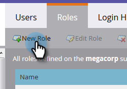

# Connexion et gestion des utilisateurs {#login-and-user-management}

## Création d’un rôle d’utilisateur Web Personalization {#create-a-web-personalization-user-role}

1. Accédez à la section **Admin** , puis cliquez sur **Utilisateurs et rôles**.

   

1. Cliquez sur **Rôles**.

   

   >[!NOTE]
   >
   >Si le rôle d’utilisateur Web Personalization (WP) existe déjà, assurez-vous qu’il est configuré comme indiqué à l’étape 4.

1. Cliquez sur **Nouveau rôle**.

   

1. Saisissez un Nom de rôle et sélectionnez Autorisations. Cliquez sur **Créer** (ce rôle doit [ s&#39;appliquer à tous les espaces de travail ](/help/marketo/product-docs/administration/users-and-roles/managing-marketo-users.md)).

   

   >[!TIP]
   >
   >Pour autoriser les utilisateurs à accéder à tout ce qui se trouve dans Target et Personalization, veillez à cocher _toutes_ les cases à cocher.

## Autorisations des utilisateurs de Personalization web et de contenu prédictif {#web-personalization-and-predictive-content-user-permissions}

**Ciblage et Personalization** : l’utilisateur ne dispose que d’autorisations d’affichage, si cette autorisation est uniquement sélectionnée.

**Admin Web Personalization + Predictive** : l’utilisateur a accès uniquement aux paramètres du compte et aux paramètres de contenu pour l’application Web Personalization et Predictive Content. Les utilisateurs peuvent afficher des pages dans l’application, mais ne disposent pas des autorisations de création, de modification, de suppression et de lancement.

**Éditeur de contenu prédictif** : l’utilisateur a accès à l’éditeur de l’application de contenu prédictif. L’autorisation permet de créer, modifier et supprimer des éléments de contenu. Il ne permet pas d’activer le contenu pour une utilisation prédictive sur le web ou par e-mail.

**Predictive Content Launcher** : l’utilisateur a accès à toutes les fonctionnalités de contenu prédictif, à l’exception des paramètres de compte et de contenu. L’autorisation permet de créer, modifier, supprimer et activer des éléments de contenu.

**Éditeur de campagne web** : l’utilisateur dispose d’un accès en éditeur à toutes les fonctionnalités de Personalization web pour créer, modifier et supprimer, mais pas lancer des campagnes web.

**Lanceur de campagne web** : l’utilisateur a accès à toutes les fonctionnalités de l’application web Personalization, à l’exception des paramètres de compte et de contenu. L&#39;autorisation permet de créer, modifier, supprimer et lancer des campagnes Web.

## Attribution d’un rôle WP à l’utilisateur {#assign-wp-role-to-user}

1. Accédez à **Users**.

   

1. Sélectionnez l’utilisateur auquel accorder l’accès à WP et cliquez sur **Modifier l’utilisateur**.

   

1. Sélectionnez le rôle utilisateur WP pour tous les espaces de travail.

   

1. Les nouveaux utilisateurs verront la mosaïque **Personalization Web** dans My Marketo la prochaine fois qu’ils se connecteront.

   
