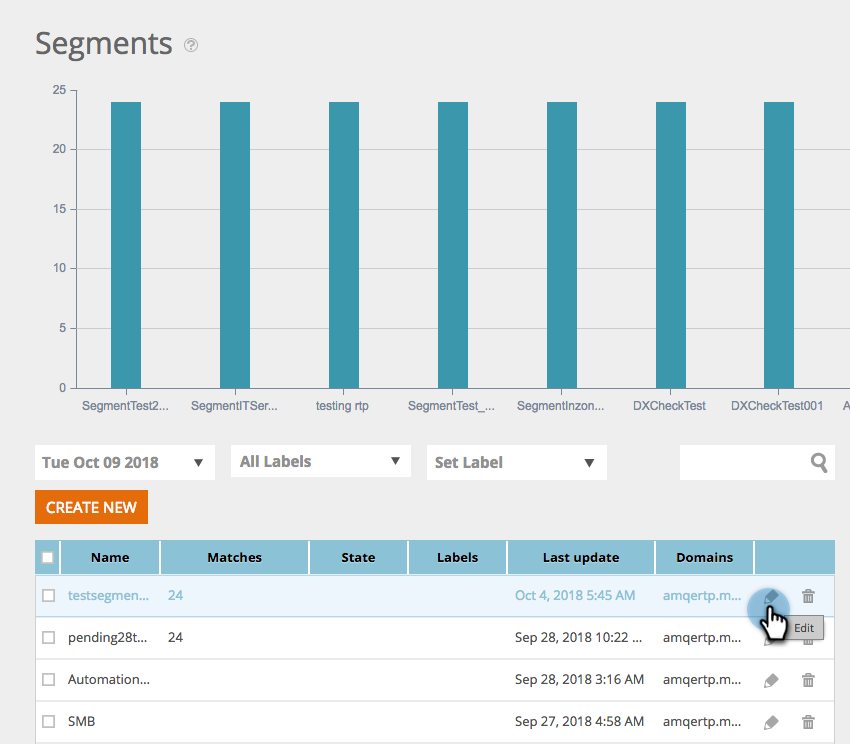

# Espaces de travail dans [!UICONTROL  Web Personalization ] {#workspaces-in-web-personalization}

[!UICONTROL Web Personalization] prend en charge plusieurs espaces de travail pour les campagnes web et les segments web.

## Changer d’espace de travail {#switch-workspaces}

Pour basculer entre les espaces de travail dans la personnalisation web, cliquez sur l’icône en forme de globe en haut à gauche et choisissez un autre espace de travail dans la liste déroulante.

## Modification du Workspace d’un segment {#change-a-segments-workspace}

1. Accédez à la page **[!UICONTROL Segments]**, sélectionnez un segment, puis cliquez sur l’icône de modification.

   

1. Sélectionnez un autre espace de travail dans la liste déroulante **[!UICONTROL Workspace]**.

   

   

>[!NOTE]
>
>Les utilisateurs ne pourront afficher que les campagnes web et les segments associés aux espaces de travail auxquels ils ont accès. Voici comment [donner à un utilisateur l&#39;accès à un ou plusieurs espaces de travail](/help/marketo/product-docs/administration/workspaces-and-person-partitions/allow-user-access-to-a-workspace.md).
