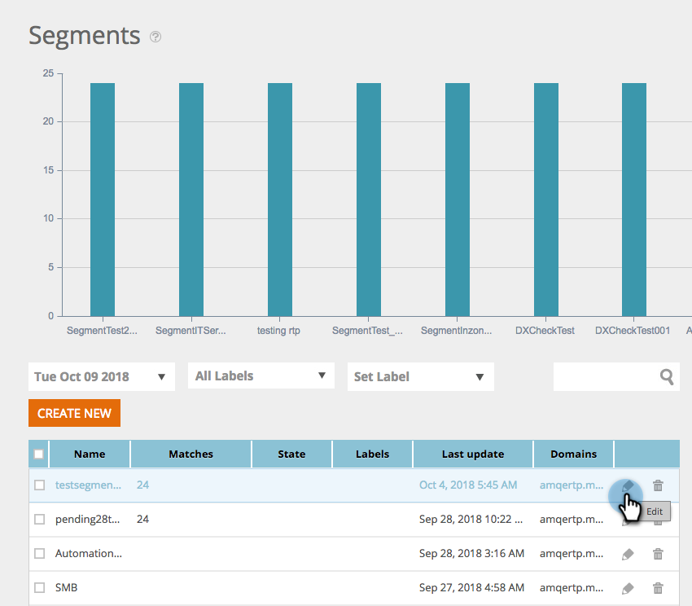

# Espaces de travail dans la personnalisation Web {#workspaces-in-web-personalization}

La personnalisation Web prend en charge plusieurs espaces de travail pour les campagnes Web et les segments Web.

## Changer d’espace de travail {#switch-workspaces}

Pour passer d’un espace de travail à l’autre dans la personnalisation Web, cliquez sur l’icône en forme de globe en haut à gauche et choisissez un autre espace de travail dans la liste déroulante.

## Modification de l’espace de travail d’un segment {#change-a-segments-workspace}

1. Accédez à la page **Segments** , sélectionnez un segment, puis cliquez sur l’icône Modifier.

   

1. Sélectionnez un autre espace de travail dans la liste déroulante **Workspace** .

   

   

>[!NOTE]
>
>Les utilisateurs ne pourront afficher que les campagnes Web et les segments associés aux espaces de travail auxquels ils ont accès. Voici comment [donner à un utilisateur l’accès à un ou plusieurs espaces de travail](../../../product-docs/administration/workspaces-and-person-partitions/allow-user-access-to-a-workspace.md).

