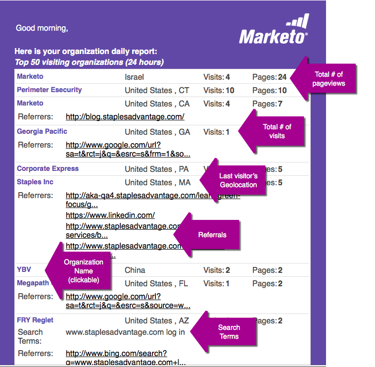

# Rapports par courriel {#email-reports}

Pour personnaliser le rapport de courrier électronique automatisé reçu par l’utilisateur, voir la section [Paramètres](/help/marketo/product-docs/web-personalization/getting-started/user-settings.md)utilisateur.

## Rapports par courriel sur la personnalisation Web {#web-personalization-email-reports}

Des rapports par courriel quotidiens ou hebdomadaires sont envoyés à l’adresse électronique de l’utilisateur, ce qui fournit les dernières données de performances sur l’organisation, la personne, la campagne et les ressources.

Les rapports suivants sont disponibles :

## Rapport organisations quotidiennes/hebdomadaires {#daily-weekly-organizations-report}

Le rapport quotidien/hebdomadaire envoie à l’utilisateur un courriel des 50 principales organisations visiteuses, y compris le nom de l’organisation, l’emplacement, le nombre de visites, les vues de page et le site référent ou le terme de recherche utilisé.

## Rapport Personnes quotidiennes/hebdomadaires {#daily-weekly-people-report}

Le rapport Personnes quotidien/hebdomadaire envoie à l’utilisateur un courriel contenant les 100 dernières personnes sur le site Web, selon les critères suivants : adresse électronique de la personne, nom de l’organisation, emplacement, état, date de capture de la personne et segmente la personne à laquelle elle appartient.

## Campagnes en temps réel les plus performantes {#top-performing-real-time-campaigns}

Le rapport Campagnes en temps réel les plus performantes envoie à l’utilisateur un courrier électronique contenant les campagnes en temps réel les plus performantes, indiquant le nom de la campagne, les impressions, les clics, le segment sur lequel la campagne a réagi et le taux de conversion de la campagne.

## Rapport Actifs les plus performants {#top-performing-assets-report}

Le rapport Actifs les plus performants envoie à l’utilisateur un courrier électronique contenant les ressources de contenu les plus performantes, indiquant le nom et le pourcentage de correspondances de la ressource par rapport aux autres ressources.

## Rapport Ressources recommandées {#recommended-assets-report}

Le rapport Ressources recommandées envoie à l’utilisateur un courrier électronique contenant tout le contenu et le nombre de clics provenant du contenu affiché dans le moteur de recommandation de contenu.

## Rapport récapitulatif {#summary-report}

Le rapport Résumé envoie à l’utilisateur un courriel (mensuel ou trimestriel) de toutes les campagnes et des performances de contenu recommandées en fonction du nombre de clics et du nombre de personnes (directes ou assistées) qui se sont engagées dans la campagne personnalisée ou le contenu recommandé et qui sont ensuite devenues une personne connue. Le rapport compare les résultats au mois ou trimestre précédent.

>[!NOTE]
>
>**Définitions**
>
>**Conversion** directe : Un visiteur Web qui clique sur une campagne personnalisée ou une ressource de contenu recommandée et, au cours de la même session de visite, remplit tout formulaire du site Web avec son adresse électronique.
>
>**Conversion** assistée : Visiteur Web qui remplit n’importe quel formulaire du site Web et laisse son adresse électronique, tandis que, lors d’une précédente visite (au cours des 6 derniers mois), il a cliqué sur une campagne personnalisée ou sur un fichier de contenu recommandé.

>[!NOTE]
>
>La personnalisation Web du marketing capture l’adresse électronique du visiteur Web pour tout formulaire renseigné sur le site Web. Il s’agit de la personne qui est utilisée dans le rapport Résumé et qui est affichée dans la page Personnes pour la personnalisation Web.

Pour personnaliser le rapport de courrier électronique automatisé reçu par l’utilisateur, voir la section [Paramètres](/help/marketo/product-docs/web-personalization/getting-started/user-settings.md)utilisateur.
