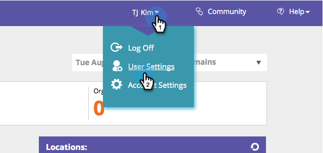

# Activer/désactiver les Abonnements de rapports {#enable-disable-report-subscriptions}

La personnalisation Web comporte plusieurs rapports utiles qui sont envoyés par courriel. Voici comment s&#39;y abonner.

1. Connectez-vous à la personnalisation Web. Sous votre nom de connexion, cliquez sur **Paramètres utilisateur**.

   

1. Sélectionnez le rapport auquel vous souhaitez vous abonner et sa fréquence. Cliquez sur **Enregistrer**.

   

   C&#39;est tout ! Pour vous désabonner du rapport, désélectionnez simplement et cliquez sur **Enregistrer**.

