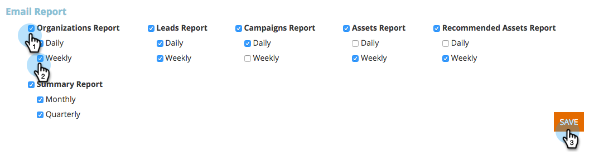

# Activer/désactiver les abonnements aux rapports {#enable-disable-report-subscriptions}

[!UICONTROL Web Personalization] comporte plusieurs rapports utiles qui sont envoyés par e-mail. Voici comment s’y abonner.

1. Connectez-vous à [!UICONTROL  Web Personalization ]. Sous votre nom d’utilisateur, cliquez sur **[!UICONTROL Paramètres utilisateur]**.

   

1. Sélectionnez le rapport auquel vous souhaitez vous abonner et il s’agit d’une fréquence. Cliquez sur **[!UICONTROL Enregistrer]**

   

   Pour vous désabonner du rapport, décochez la case et cliquez sur **[!UICONTROL Enregistrer]**.
