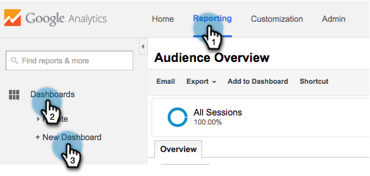
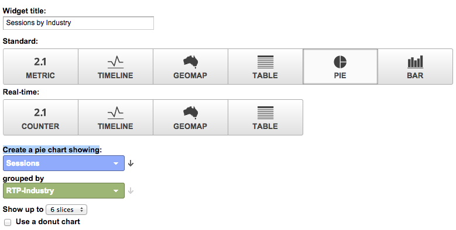
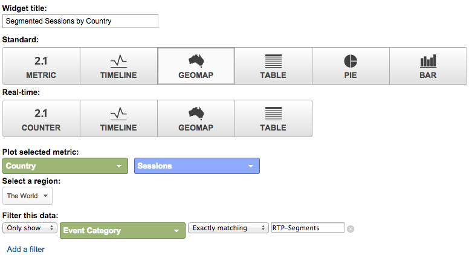
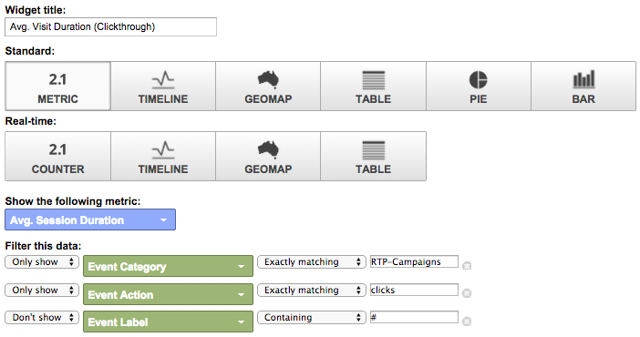

# Tableaux de bord RTP personnalisés dans Google Universal Analytics {#custom-rtp-dashboards-in-google-universal-analytics}

>[!PREREQUISITES]
>
>[Intégration de RTP à Google Universal Analytics](integrate-rtp-with-google-universal-analytics.md)

Ce billet explique comment configurer des tableaux de bord RTP dans Google Universal Analytics (GUA).  Les données envoyées de RTP à GUA peuvent être configurées sous la forme de deux tableaux de bord personnalisés distincts appelés :

* RTP B2B
* Engagement RTP

## Configuration d’un Tableau de bord personnalisé {#setting-up-a-custom-dashboard}

1. Connectez-vous aux Google Analytics. Cliquez sur **Rapports **dans le menu supérieur. Cliquez sur **Tableaux de bord **et **+Nouveau Tableau de bord personnalisé.**

   

1. Sélectionnez **Canevas vierge**, ajoutez un **nom du Tableau de bord** et cliquez sur **Créer un Tableau de bord**.

1. Cliquez sur **Ajouter le widget** pour créer un widget.\
   

## Tableau de bord RTP B2B {#rtp-b-b-dashboard}

Ce tableau de bord permet aux utilisateurs d&#39;analyser les performances de leur site Web du point de vue B2B.

Il fournit des informations telles que la source des visites et le comportement sur site par secteur d’activité, les recettes, la taille, les listes basées sur le compte et les segments de cible.

Le tableau de bord se compose de 3 colonnes.

* Source du trafic
* Segmentation
* Zoom avant sur les microrégraphies

1. Créez un nouveau tableau de bord appelé **RTP B2B Tableau de bord **et définissez les widgets suivants :

<table> 
 <thead> 
  <tr> 
   <th> 
    

      Colonne 1 - Sources de trafic 
    
</th> 
   <th> 
    
 <strong>Colonne 2 - Segmentation</strong> 
    
</th> 
   <th> 
    
 <strong>Colonne 3 - Analyse micrographique</strong> 
    
</th> 
  </tr> 
 </thead> 
 <tbody> 
  <tr> 
   <td> 
    <ul> 
     <li>Nom : Sessions par segment et Canal</li> 
     <li>Type de widget : Barre </li> 
     <li>Créez un graphique à barres présentant les éléments suivants : Session</li> 
     <li>Regroupé par : Libellé du événement</li> 
     <li>Pivot par : Regroupement de Canaux par défaut</li> 
     <li>Filtre :  Afficher uniquement | Catégorie de Événement (contenant) RTP-Segments</li> 
    </ul>

</td> 
   <td> 
    <ul> 
     <li>Nom : Nombre d'utilisateurs segmentés RTP</li> 
     <li>Type : 2.1 Mesure</li> 
     <li>Afficher la mesure suivante : Utilisateurs </li> 
     <li>Filtre :  Afficher uniquement | Catégorie de Événement (contenant) RTP-Segments</li> 
    </ul>

</td> 
   <td> 
    <ul> 
     <li>Nom : Sessions par secteur</li> 
     <li>Type : Diagramme </li> 
     <li>Créez un graphique circulaire présentant : Sessions</li> 
     <li>Regroupé par : RTP-Industrie</li> 
    </ul>

</td> 
  </tr> 
  <tr> 
   <th> 
    <ul> 
     <li><strong>Nom : Sessions par secteur et Canaux</strong></li> 
     <li><strong>Type de widget : Barre</strong></li> 
     <li><strong>Créez un graphique à barres présentant les éléments suivants : Session</strong></li> 
     <li><strong>Regroupé par : RTP-Industrie</strong></li> 
     <li><strong>Pivot par : Regroupement de Canaux par défaut</strong> </li> 
    </ul></th> 
   <th> 
    <ul> 
     <li><strong>Nom : Sessions segmentées par pays</strong></li> 
     <li><strong>Type : Geomap</strong></li> 
     <li><strong>Traiter la mesure sélectionnée : Pays | Sessions</strong></li> 
     <li><strong>Sélectionnez une région : Le monde</strong></li> 
     <li><strong>Filtre : Afficher uniquement | Catégorie de Événement (contenant) RTP-Segments</strong></li> 
    </ul>

</th> 
   <th> 
    <ul> 
     <li><strong>Nom : Sessions par Catégorie RTP</strong></li> 
     <li><strong>Type : Diagramme</strong></li> 
     <li><strong>Créez un graphique circulaire présentant : Sessions</strong></li> 
     <li><strong>Regroupé par : Catégorie RTP</strong></li> 
    </ul>

</th> 
  </tr> 
  <tr> 
   <th> </th> 
   <th> 
    <ul> 
     <li>Nom : Principaux segments de Cible</li> 
     <li>Type : Barre</li> 
     <li>Créez un graphique à barres présentant les éléments suivants : Utilisateurs</li> 
     <li>Regroupé par : Action événement</li> 
     <li>Filtre : Afficher uniquement | Catégorie de Événement (contenant) RTP-Segments</li> 
    </ul>

</th> 
   <th> 
    <ul> 
     <li>Nom : Sessions par groupes RTP</li> 
     <li>Type : Barre </li> 
     <li>Créez un graphique à barres présentant les éléments suivants : Sessions</li> 
     <li>Regroupé par : RTP-Group</li> 
    </ul>
<strong></strong>
</th> 
  </tr> 
  <tr> 
   <th> </th> 
   <th> 
    <ul> 
     <li>Nom : Sessions et objectifs par principaux segments</li> 
     <li>Type : Tableau </li> 
     <li>Affichez les colonnes suivantes :  Étiquette de Événement | Sessions | Taux de conversion d'objectif</li> 
     <li>Filtre :  Afficher uniquement | Catégorie de Événement (contenant) RTP-Segments</li> 
    </ul>
<strong></strong>
</th> 
   <th> </th> 
  </tr> 
 </tbody> 
</table>

## Tableau de bord d’engagement RTP {#rtp-engagement-dashboard}

Ce tableau de bord permet aux utilisateurs d’analyser les performances de leurs campagnes RTP et les engagements de leurs moteurs de recommandation. Il fournit une comparaison de la moyenne. durée de la session et pages par session entre :

* 

   * Non engagé
   * Engagé (impressions et clics sur une campagne personnalisée)
   * Clics sur le moteur de recommandation et le contenu recommandé le plus élevé

Créez un nouveau tableau de bord appelé **Tableau de bord d’engagement RTP** et définissez les widgets suivants :

<table> 
 <thead> 
  <tr> 
   <th> 
    
 <strong>Colonne 1 Exposition des campagnes</strong> 
    
</th> 
   <th> 
    
 <strong>Colonne 2 Campagnes Clics publicitaires</strong> 
    
</th> 
   <th> 
    
 <strong>Moteur de recommandation de colonne 3</strong> 
    
</th> 
  </tr> 
 </thead> 
 <tbody> 
  <tr> 
   <td> 
    <ul> 
     <li>Nom : <strong>CTA total (engagement)</strong></li> 
     <li>Type : <strong>Mesure 2.1 </strong></li> 
     <li>Afficher la mesure suivante : <strong>Événements totaux</strong></li> 
     <li>Filtres :  <strong>[afficher uniquement] Catégorie de Événement (contient) : RTP-Campaigns</strong> <strong>[afficher uniquement] l’action du Événement (correspondance exacte) : Impression</strong><strong>[n’affiche pas] Étiquette de Événement (contenant) : #</strong></li> 
    </ul>
<strong></strong>
</td> 
   <td> 
    <ul> 
     <li>Nom : <strong>Total CTA (Clics publicitaires)</strong></li> 
     <li>Type : <strong>Mesure 2.1 </strong></li> 
     <li>Afficher la mesure suivante : <strong>Événements totaux</strong></li> 
     <li>Filtres :  <strong>[afficher uniquement] Catégorie de Événement (contient) : RTP-Campaigns</strong> <strong>[afficher uniquement] l’action du Événement (correspondance exacte) : Cliquez sur </strong><strong>[n'affiche pas] Étiquette de Événement (contenant) : #</strong></li> 
    </ul>
<strong></strong>
</td> 
   <td> 
    <ul> 
     <li>Nom : <strong>CRE - Nombre total de clics</strong></li> 
     <li>Type : <strong>2.1 Mesure</strong> </li> 
     <li>Afficher la mesure suivante : <strong>Pages vues</strong></li> 
     <li>Filtre : <strong>[afficher uniquement] Page (contenant) : rcmd</strong></li> 
    </ul>

</td> 
  </tr> 
  <tr> 
   <td colspan="1"> 
    <ul> 
     <li>Nom : <strong>Moy. Durée de la session (engagement)</strong></li> 
     <li>Type : <strong>Mesure 2.1 </strong></li> 
     <li>Afficher la mesure suivante : <strong>Moy. Durée de session</strong></li> 
     <li>Filtres :  <strong>[afficher uniquement] Catégorie de Événement (correspondant exactement à) : RTP-Campaigns</strong> <strong>[afficher uniquement] l’action du Événement (correspondance exacte) : impression</strong><strong>[ne pas afficher] Étiquette de Événement (contenant) : #</strong></li> 
    </ul>
<strong></strong>
</td> 
   <td colspan="1"> 
    <ul> 
     <li>Nom : <strong>Moy. Durée de la session (clic publicitaire)</strong></li> 
     <li>Type : <strong>Mesure 2.1 </strong></li> 
     <li>Afficher la mesure suivante : <strong>Moy. Durée de session</strong></li> 
     <li>Filtres :  <strong>[afficher uniquement] Catégorie de Événement (correspondant exactement à) : RTP-Campaigns</strong> <strong>[afficher uniquement] l’action du Événement (correspondance exacte) : clics</strong><strong>[ne pas afficher] Étiquette de Événement (contenant) : #</strong></li> 
    </ul>
<strong></strong>
</td> 
   <td colspan="1"> 
    <ul> 
     <li>Nom : <strong>CRE - Principaux contenus recommandés</strong></li> 
     <li>Type : <strong>Tableau</strong> </li> 
     <li>Affichez les colonnes suivantes :  <strong>Titre de la page | Pages vues</strong> </li> 
     <li>Filtres :  Filtre : <strong>[afficher uniquement] Page (contenant) : rcmd</strong></li> 
    </ul>

</td> 
  </tr> 
  <tr> 
   <td> 
    <ul> 
     <li>Nom : <strong>Pages / Session (Engagement)</strong></li> 
     <li>Type : <strong>Mesure 2.1 </strong></li> 
     <li>Afficher la mesure suivante : <strong>Pages / Session</strong></li> 
     <li>Filtres :  <strong>[afficher uniquement] Catégorie de Événement (correspondant exactement à) : RTP-Campaigns</strong></li> 
     <li><strong>[afficher uniquement] Action de Événement (correspondance exacte) : impression</strong></li> 
     <li><strong>[ne pas afficher] Étiquette de Événement (contenant) : #</strong></li> 
    </ul>

</td> 
   <td> 
    <ul> 
     <li>Nom : <strong>Pages / Session (Clics publicitaires)</strong></li> 
     <li>Type : <strong>Mesure 2.1 </strong></li> 
     <li>Afficher la mesure suivante : <strong>Pages / Session</strong></li> 
     <li>Filtres :  <strong>[afficher uniquement] Catégorie de Événement (correspondant exactement à) : RTP-Campaigns</strong></li> 
     <li><strong>[afficher uniquement] Action de Événement (correspondance exacte) : clics</strong></li> 
     <li><strong>[ne pas afficher] Étiquette de Événement (contenant) : #</strong></li> 
    </ul>
<strong></strong>
</td> 
   <td> </td> 
  </tr> 
  <tr> 
   <td> 
    <ul> 
     <li>Nom : <strong>Impressions par CTA</strong></li> 
     <li>Type : <strong>Tableau</strong></li> 
     <li>Affichez les colonnes suivantes : <strong>Étiquette de Événement | Total des Événements | Utilisateurs</strong></li> 
     <li>Filtres :  <strong>[afficher uniquement] Catégorie de Événement (correspondant exactement à) : RTP-Campaigns</strong> <strong>[afficher uniquement] l’action du Événement (correspondance exacte) : impression</strong><strong>[ne pas afficher] Étiquette de Événement (contenant) : #</strong></li> 
    </ul>

</td> 
   <td> 
    <ul> 
     <li>Nom : <strong>Clics publicitaires par CTA</strong></li> 
     <li>Type : <strong>Tableau</strong></li> 
     <li>Affichez les colonnes suivantes : <strong>Étiquette de Événement | Total des Événements | Utilisateurs</strong></li> 
     <li>Filtres :  <strong>[afficher uniquement] Catégorie de Événement (correspondant exactement à) : RTP-Campaigns</strong> <strong>[afficher uniquement] l’action du Événement (correspondance exacte) : clics</strong></li> 
    </ul>

</td> 
   <td> </td> 
  </tr> 
 </tbody> 
</table>

>[!MORELIKETHIS]
>
>[Intégration de RTP à Google Universal Analytics](integrate-rtp-with-google-universal-analytics.md)
>
>[Rapports RTP personnalisés dans Google Universal Analytics](custom-rtp-reports-in-google-universal-analytics.md)

