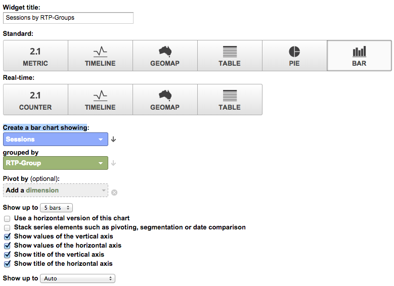

# Tableaux de bord RTP personnalisés dans Google Universal Analytics {#custom-rtp-dashboards-in-google-universal-analytics}

>[!PREREQUISITES]
>
>[Intégration de RTP à Google Universal Analytics](/help/marketo/product-docs/web-personalization/reporting-for-web-personalization/web-analytics-integrations/integrate-rtp-with-google-universal-analytics.md)

Cette publication explique comment configurer des tableaux de bord RTP dans Google Universal Analytics (GUA). Les données envoyées de la méthode RTP à la méthode GUA peuvent être configurées en tant que deux tableaux de bord personnalisés distincts appelés :

* RTP B2B
* Engagement RTP

## Configuration d’un tableau de bord personnalisé {#setting-up-a-custom-dashboard}

1. Connectez-vous aux Google Analytics. Cliquez sur **Reporting** dans le menu supérieur. Cliquez sur **Tableaux de bord** et **+Nouveau tableau de bord personnalisé**.

   

1. Sélectionnez **Canevas vierge**, ajoutez un **nom du tableau de bord** et cliquez sur **Créer un tableau de bord**.

1. Cliquez sur **Ajouter un widget** pour créer un widget.

   

## Tableau de bord RTP B2B {#rtp-b-b-dashboard}

Ce tableau de bord permet aux utilisateurs d’analyser les performances de leur site web du point de vue B2B.

Il fournit des informations telles que le comportement de la source des visites et du site par secteur, recettes, taille, listes basées sur les comptes et segments cibles.

Le tableau de bord se compose de 3 colonnes.

* Source du trafic
* Segmentation
* Exploration de la technologie

1. Créez un tableau de bord appelé **Tableau de bord B2B RTP** et définissez les widgets suivants :

<table> 
 <thead> 
  <tr> 
   <th> 
    

      Colonne 1 - Sources de trafic
    
</th> 
   <th> 
    
 <strong>Colonne 2 - Segmentation</strong> 
    
</th> 
   <th> 
    
 <strong>Colonne 3 - Zoom avant sur la micrographie</strong> 
    
</th> 
  </tr> 
 </thead> 
 <tbody> 
  <tr> 
   <td> 
    <ul> 
     <li>Nom : sessions par segments et canaux</li> 
     <li>Type de widget : Barre </li> 
     <li>Création d’un graphique à barres présentant : Session</li> 
     <li>Regroupement par : libellé de l'événement</li> 
     <li>Pivoter par : Regroupement de canaux par défaut</li> 
     <li>Filtre :   Afficher uniquement | Catégorie d’événements (contenant) RTP-Segments</li> 
    </ul>

</td> 
   <td> 
    <ul> 
     <li>Nom : nombre d’utilisateurs segmentés par HTTP</li> 
     <li>Type : mesure 2.1</li> 
     <li>Afficher la mesure suivante : Utilisateurs </li> 
     <li>Filtre :   Afficher uniquement | Catégorie d’événements (contenant) RTP-Segments</li> 
    </ul>

</td> 
   <td> 
    <ul> 
     <li>Nom : Sessions par secteur industriel</li> 
     <li>Type : secteurs </li> 
     <li>Créez un graphique circulaire présentant : Sessions</li> 
     <li>Regroupé par : RTP-Industry</li> 
    </ul>

</td> 
  </tr> 
  <tr> 
   <th> 
    <ul> 
     <li><strong>Nom : Sessions par secteur et canaux</strong></li> 
     <li><strong>Type de widget : Barre</strong></li> 
     <li><strong>Création d’un graphique à barres présentant : Session</strong></li> 
     <li><strong>Regroupé par : RTP-Industry</strong></li> 
     <li><strong>Pivoter par : Regroupement de canaux par défaut</strong> </li> 
    </ul></th> 
   <th> 
    <ul> 
     <li><strong>Nom : Sessions segmentées par pays</strong></li> 
     <li><strong>Type : Geomap</strong></li> 
     <li><strong>Traiter la mesure sélectionnée : Pays | Sessions</strong></li> 
     <li><strong>Choisissez une région : le monde</strong></li> 
     <li><strong>Filtre : Afficher uniquement | Catégorie d’événements (contenant) RTP-Segments</strong></li> 
    </ul>

</th> 
   <th> 
    <ul> 
     <li><strong>Nom : Sessions par catégorie de HTTP</strong></li> 
     <li><strong>Type : secteurs</strong></li> 
     <li><strong>Créez un graphique circulaire présentant : Sessions</strong></li> 
     <li><strong>Regroupé par : catégorie-RTP</strong></li> 
    </ul>

</th> 
  </tr> 
  <tr> 
   <th> </th> 
   <th> 
    <ul> 
     <li>Nom : Segments cibles principaux</li> 
     <li>Type : Barre</li> 
     <li>Créez un graphique à barres affichant : Utilisateurs</li> 
     <li>Groupé par : Action de l’événement</li> 
     <li>Filtre : Afficher uniquement | Catégorie d’événements (contenant) RTP-Segments</li> 
    </ul>

</th> 
   <th> 
    <ul> 
     <li>Nom : Sessions par groupes RTP</li> 
     <li>Type : Barre </li> 
     <li>Créez un graphique à barres affichant : Sessions</li> 
     <li>Regroupé par : Groupe-RTP</li> 
    </ul>
<strong></strong>
</th> 
  </tr> 
  <tr> 
   <th> </th> 
   <th> 
    <ul> 
     <li>Nom : Sessions et objectifs par principaux segments</li> 
     <li>Type : Tableau </li> 
     <li>Afficher les colonnes suivantes :  Libellé de l'événement | Sessions | Taux de conversion de l’objectif</li> 
     <li>Filtre :   Afficher uniquement | Catégorie d’événements (contenant) RTP-Segments</li> 
    </ul>
<strong></strong>
</th> 
   <th> </th> 
  </tr> 
 </tbody> 
</table>

## Tableau de bord de l’engagement RTP {#rtp-engagement-dashboard}

Ce tableau de bord permet aux utilisateurs d’analyser les performances de leur campagne RTP et les engagements de leur moteur de recommandations. Il fournit une comparaison de la moyenne. durée de session et pages par session entre :

* Non engagé
* Engagé (impressions et clics sur une campagne personnalisée)
* Clics sur le moteur de recommandation et le contenu recommandé supérieur

Créez un tableau de bord appelé **Tableau de bord de l’engagement RTP** et définissez les widgets suivants :

<table> 
 <thead> 
  <tr> 
   <th> 
    
 <strong>Exposition des campagnes sur la colonne 1</strong> 
    
</th> 
   <th> 
    
 <strong>Clics sur les campagnes de colonne 2</strong> 
    
</th> 
   <th> 
    
 <strong>Moteur de recommandation Colonne 3</strong> 
    
</th> 
  </tr> 
 </thead> 
 <tbody> 
  <tr> 
   <td> 
    <ul> 
     <li>Nom : <strong>Total CTA (engagement)</strong></li> 
     <li>Type : <strong>2.1 Metric </strong></li> 
     <li>Afficher la mesure suivante : <strong>Total des événements</strong></li> 
     <li>Filtres : <strong>[afficher uniquement] Catégorie d’événements (contient) : RTP-Campaigns</strong> <strong>[afficher uniquement] Action d’événement (correspondance exacte) : Impression</strong><strong>[n’afficher pas] Étiquette d’événement (contenant) : #</strong></li> 
    </ul>
<strong></strong>
</td> 
   <td> 
    <ul> 
     <li>Nom : <strong>Total CTA (clic publicitaire)</strong></li> 
     <li>Type : <strong>2.1 Metric </strong></li> 
     <li>Afficher la mesure suivante : <strong>Total des événements</strong></li> 
     <li>Filtres : <strong>[afficher uniquement] Catégorie d’événements (contient) : RTP-Campaigns</strong> <strong>[afficher uniquement] Action d’événement (correspondance exacte) : Clics</strong><strong>[n’afficher pas] Étiquette d’événement (contenant) : #</strong></li> 
    </ul>
<strong></strong>
</td> 
   <td> 
    <ul> 
     <li>Nom : <strong>CRE - Nombre total de clics</strong></li> 
     <li>Type : <strong>2.1 Metric</strong> </li> 
     <li>Afficher la mesure suivante : <strong>Pageviews</strong></li> 
     <li>Filtre : <strong>[afficher uniquement] Page (contenant) : rcmd</strong></li> 
    </ul>

</td> 
  </tr> 
  <tr> 
   <td colspan="1"> 
    <ul> 
     <li>Nom : <strong>Durée Durée de la session (engagement)</strong></li> 
     <li>Type : <strong>2.1 Metric </strong></li> 
     <li>Afficher la mesure suivante : <strong>Durée Durée de la session</strong></li> 
     <li>Filtres : <strong>[afficher uniquement] Catégorie d’événements (correspondance exacte) : RTP-Campagnes</strong> <strong>[afficher uniquement] Action d’événement (correspondance exacte) : impression</strong><strong>[n’afficher pas] Étiquette d’événement (contenant) : #</strong></li> 
    </ul>
<strong></strong>
</td> 
   <td colspan="1"> 
    <ul> 
     <li>Nom : <strong>Durée Durée de la session (clic publicitaire)</strong></li> 
     <li>Type : <strong>2.1 Metric </strong></li> 
     <li>Afficher la mesure suivante : <strong>Durée Durée de la session</strong></li> 
     <li>Filtres : <strong>[afficher uniquement] Catégorie d’événements (correspondance exacte) : RTP-Campagnes</strong> <strong>[afficher uniquement] Action d’événement (correspondance exacte) : clics</strong><strong>[n’afficher pas] Étiquette d’événement (contenant) : #</strong></li> 
    </ul>
<strong></strong>
</td> 
   <td colspan="1"> 
    <ul> 
     <li>Nom : <strong>CRE - Top Recommandé Content</strong></li> 
     <li>Type : <strong>Table</strong> </li> 
     <li>Afficher les colonnes suivantes :  <strong>Titre de page | Pageviews</strong> </li> 
     <li>Filtres : Filtre : <strong>[afficher uniquement] Page (contenant) : rcmd</strong></li> 
    </ul>

</td> 
  </tr> 
  <tr> 
   <td> 
    <ul> 
     <li>Nom : <strong> Pages / Session (engagement)</strong></li> 
     <li>Type : <strong>2.1 Metric </strong></li> 
     <li>Afficher la mesure suivante : <strong>Pages / Session</strong></li> 
     <li>Filtres : <strong>[afficher uniquement] Catégorie d’événements (correspondance exacte) : RTP-Campagnes</strong></li> 
     <li><strong>[afficher uniquement] Action de l’événement (correspondance exacte) : impression</strong></li> 
     <li><strong>[ne pas afficher] Libellé de l’événement (contenant) : #</strong></li> 
    </ul>

</td> 
   <td> 
    <ul> 
     <li>Nom : <strong> Pages / Session (clic publicitaire)</strong></li> 
     <li>Type : <strong>2.1 Metric </strong></li> 
     <li>Afficher la mesure suivante : <strong>Pages / Session</strong></li> 
     <li>Filtres : <strong>[afficher uniquement] Catégorie d’événements (correspondance exacte) : RTP-Campagnes</strong></li> 
     <li><strong>[afficher uniquement] Action de l’événement (correspondance exacte) : clics</strong></li> 
     <li><strong>[ne pas afficher] Libellé de l’événement (contenant) : #</strong></li> 
    </ul>
<strong></strong>
</td> 
   <td> </td> 
  </tr> 
  <tr> 
   <td> 
    <ul> 
     <li>Nom : <strong>Impressions par CTA</strong></li> 
     <li>Type : <strong>Table</strong></li> 
     <li>Afficher les colonnes suivantes : <strong>Libellé de l'événement | Nombre total d’événements | Utilisateurs</strong></li> 
     <li>Filtres : <strong>[afficher uniquement] Catégorie d’événements (correspondance exacte) : RTP-Campagnes</strong> <strong>[afficher uniquement] Action d’événement (correspondance exacte) : impression</strong><strong>[n’afficher pas] Étiquette d’événement (contenant) : #</strong></li> 
    </ul>

</td> 
   <td> 
    <ul> 
     <li>Nom : <strong>Clickthrough by CTA</strong></li> 
     <li>Type : <strong>Table</strong></li> 
     <li>Afficher les colonnes suivantes : <strong>Libellé de l'événement | Nombre total d’événements | Utilisateurs</strong></li> 
     <li>Filtres : <strong>[afficher uniquement] Catégorie d’événements (correspondance exacte) : RTP-Campaigns</strong> <strong>[afficher uniquement] Action d’événement (correspondance exacte) : clics</strong></li> 
    </ul>

</td> 
   <td> </td> 
  </tr> 
 </tbody> 
</table>

>[!MORELIKETHIS]
>
>[Intégration de RTP à Google Universal Analytics](/help/marketo/product-docs/web-personalization/reporting-for-web-personalization/web-analytics-integrations/custom-rtp-reports-in-google-universal-analytics.md)
>
>[Rapports RTP personnalisés dans Google Universal Analytics](/help/marketo/product-docs/web-personalization/reporting-for-web-personalization/web-analytics-integrations/custom-rtp-reports-in-google-universal-analytics.md)
