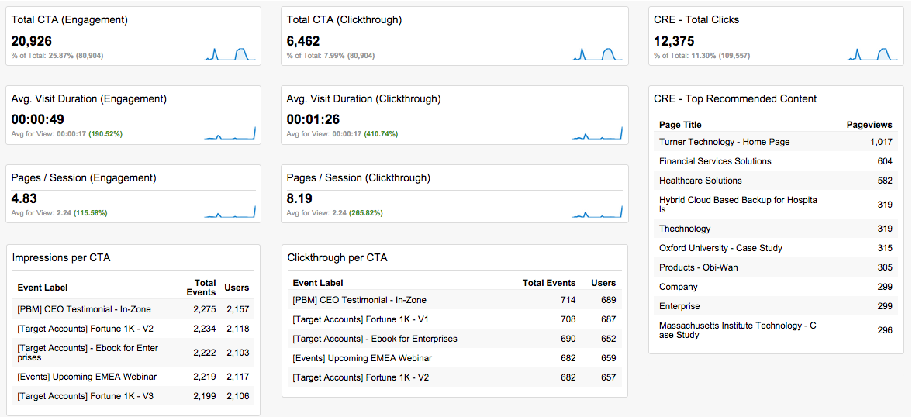
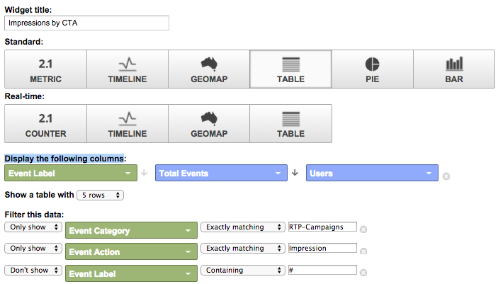

# Tableaux de bord RTP personnalisés dans Google Universal Analytics {#custom-rtp-dashboards-in-google-universal-analytics}

>[!PREREQUISITES]
>
>[Intégration du RTP à Google Universal Analytics](/help/marketo/product-docs/web-personalization/reporting-for-web-personalization/web-analytics-integrations/integrate-rtp-with-google-universal-analytics.md)

Cette publication explique comment configurer des tableaux de bord RTP dans Google Universal Analytics (GUA). Les données envoyées de RTP vers GUA peuvent être configurées sous la forme de deux tableaux de bord personnalisés distincts appelés :

* RTP B2B
* Engagement RTP

## Configuration d’un tableau de bord personnalisé {#setting-up-a-custom-dashboard}

1. Connectez-vous à Google Analytics. Cliquez sur **[!UICONTROL Reporting]** dans le menu supérieur. Cliquez sur **[!UICONTROL Tableaux de bord]** et **[!UICONTROL Nouveau tableau de bord]**.

   

1. Sélectionnez **Zone de travail vierge**, ajoutez un **Nom du tableau de bord** et cliquez sur **[!UICONTROL Créer un tableau de bord]**.

1. Cliquez sur **[!UICONTROL Ajouter un widget]** pour créer un widget.

   

## Tableau de bord RTP B2B {#rtp-b-b-dashboard}

Ce tableau de bord permet aux utilisateurs d’analyser les performances de leur site web du point de vue B2B.

Il fournit des informations telles que le comportement de la source de visite et sur site par secteur, chiffre d’affaires, taille, listes basées sur les comptes et segments cibles.

Le tableau de bord se compose de 3 colonnes

* Traffic source
* Segmentation
* Analyse micrographique

1. Créez un tableau de bord appelé **Tableau de bord B2B RTP** et définissez les widgets suivants :

<table>
 <thead>
  <tr>
   <th>
    

      Colonne 1 - Sources de trafic
    
</th>
   <th>
    
 <strong>Colonne 2 - Segmentation</strong>
    
</th>
   <th>
    
 <strong>Colonne 3 - Zoom micrographique</strong>
    
</th>
  </tr>
 </thead>
 <tbody>
  <tr>
   <td>
    <ul>
     <li>Nom : sessions par segments et canaux</li>
     <li>Type de widget : Bar </li>
     <li>Créez un graphique à barres affichant  : Session</li>
     <li>Regroupé par : libellé de l'événement</li>
     <li>Pivoter par : Regroupement de canaux par défaut</li>
     <li>Filtre :  Afficher uniquement | Catégorie d’événements (contenant) RTP-Segments</li>
    </ul>

</td>
   <td>
    <ul>
     <li>Nom : nombre d’utilisateurs segmentés RTP</li>
     <li>Type : Mesure 2.1</li>
     <li>Afficher la mesure suivante : Utilisateurs </li>
     <li>Filtre :  Afficher uniquement | Catégorie d’événement (contenant) des segments RTP</li>
    </ul>

</td>
   <td>
    <ul>
     <li>Nom : Sessions par secteur</li>
     <li>Type : circulaire </li>
     <li>Créez un graphique en secteurs qui affiche  : Sessions</li>
     <li>Regroupé par : RTP-Industry</li>
    </ul>

</td>
  </tr>
  <tr>
   <th>
    <ul>
     <li><strong>Nom : Sessions par secteur et canaux</strong></li>
     <li><strong>Type de widget : Bar</strong></li>
     <li><strong>Créez un graphique à barres affichant  : Session</strong></li>
     <li><strong>Regroupé par  : RTP-Industry</strong></li>
     <li><strong>Pivoter par : Regroupement de canaux par défaut</strong> </li>
    </ul></th>
   <th>
    <ul>
     <li><strong>Nom : sessions segmentées par pays</strong></li>
     <li><strong>Type : Geomap</strong></li>
     <li><strong>Tracer la mesure sélectionnée : Pays |  Sessions </strong></li>
     <li><strong>Sélectionnez une région : Le monde</strong></li>
     <li><strong>Filtre : Afficher uniquement | Catégorie d’événement (contenant) des segments RTP</strong></li>
    </ul>

</th>
   <th>
    <ul>
     <li><strong>Nom : Sessions par catégorie RTP</strong></li>
     <li><strong>Type : circulaire</strong></li>
     <li><strong>Créez un graphique en secteurs qui affiche  : Sessions</strong></li>
     <li><strong>Regroupé par : RTP-Category</strong></li>
    </ul>

</th>
  </tr>
  <tr>
   <th> </th>
   <th>
    <ul>
     <li>Nom : Segments Cibles Principaux</li>
     <li>Type : Bar</li>
     <li>Créez un graphique à barres affichant  : Utilisateurs</li>
     <li>Regroupé par : Action d’événement</li>
     <li>Filtre : Afficher uniquement | Catégorie d’événement (contenant) des segments RTP</li>
    </ul>

</th>
   <th>
    <ul>
     <li>Nom : Sessions by RTP-Groups</li>
     <li>Type : Barre </li>
     <li>Créez un graphique à barres affichant : Sessions</li>
     <li>Regroupé par : RTP-Group</li>
    </ul>

</th>
  </tr>
  <tr>
   <th> </th>
   <th>
    <ul>
     <li>Nom : sessions et objectifs par principaux segments</li>
     <li>Type : Tableau </li>
     <li>Afficher les colonnes suivantes :  Libellé de l'événement | Sessions | Taux de conversion de l’objectif</li>
     <li>Filtre :  Afficher uniquement | Catégorie d’événement (contenant) RTP-Segments</li>
    </ul>

</th>
   <th> </th>
  </tr>
 </tbody>
</table>

## Tableau de bord d’engagement RTP {#rtp-engagement-dashboard}

Ce tableau de bord permet aux utilisateurs d’analyser les performances de leur campagne RTP et les engagements du moteur de recommandations. Il permet de comparer la moyenne. durée de la session et pages par session entre :

* Inactif
* Engagé (impressions et clics sur une campagne personnalisée)
* Clics sur le moteur de recommandation et contenu le plus recommandé

Créez un tableau de bord appelé **Tableau de bord d’engagement RTP** et définissez les widgets suivants :

<table>
 <thead>
  <tr>
   <th>
    
 <strong>Colonne 1 Exposition des campagnes</strong>
    
</th>
   <th>
    
 <strong>Colonne 2 - Clickthrough des campagnes</strong>
    
</th>
   <th>
    
 <strong>Colonne 3 Moteur de recommandation</strong>
    
</th>
  </tr>
 </thead>
 <tbody>
  <tr>
   <td>
    <ul>
     <li>Nom : <strong>Total CTA (Engagement)</strong></li>
     <li>Type : <strong>2.1 </strong> métrique</li>
     <li>Afficher la mesure suivante : <strong>Total des événements</strong></li>
     <li>Filtres : <strong>[afficher uniquement] Catégorie d’événement (contient) : RTP-Campagnes</strong> <strong>[afficher uniquement] Action d’événement (correspondant exactement) : Impression</strong>[ne pas afficher] Libellé d’événement (contenant) : #</li>
    </ul>

</td>
   <td>
    <ul>
     <li>Nom : <strong>Total CTA (Clickthrough)</strong></li>
     <li>Type : <strong>2.1 </strong> métrique</li>
     <li>Afficher la mesure suivante : <strong>Total des événements</strong></li>
     <li>Filtres : <strong>[afficher uniquement] Catégorie d’événement (contient) : RTP-Campagnes</strong> <strong>[afficher uniquement] Action d’événement (correspondant exactement) : Clics</strong><strong>[ne pas afficher] Libellé d’événement (contenant) : #</strong></li>
    </ul>

</td>
   <td>
    <ul>
     <li>Nom : <strong>CRE - Nombre total de clics</strong></li>
     <li>Type : Mesure <strong>2.1</strong> </li>
     <li>Afficher la mesure suivante : <strong>Pages vues</strong></li>
     <li>Filtre : <strong>[afficher uniquement] Page (contenant) : rcmd</strong></li>
    </ul>

</td>
  </tr>
  <tr>
   <td colspan="1">
    <ul>
     <li>Nom : <strong>Moy. Durée de la session (engagement)</strong></li>
     <li>Type : <strong>2.1 </strong> métrique</li>
     <li>Afficher la mesure suivante : <strong>Moy. Durée de la session </strong></li>
     <li>Filtres : <strong>[afficher uniquement] Catégorie d’événement (correspondant exactement) : RTP-Campagnes</strong> <strong>[afficher uniquement] Action d’événement (correspondant exactement) : impression</strong><strong>[ne pas afficher] Libellé d’événement (contenant) : #</strong></li>
    </ul>

</td>
   <td colspan="1">
    <ul>
     <li>Nom : <strong>Moy. Durée de la session (clics publicitaires)</strong></li>
     <li>Type : <strong>2.1 </strong> métrique</li>
     <li>Afficher la mesure suivante : <strong>Moy. Durée de la session </strong></li>
     <li>Filtres : <strong>[afficher uniquement] Catégorie d’événement (correspondance exacte) : RTP-Campagnes</strong> <strong>[afficher uniquement] Action d’événement (correspondance exacte) : clics</strong><strong>[ne pas afficher] Libellé d’événement (contenant) : #</strong></li>
    </ul>

</td>
   <td colspan="1">
    <ul>
     <li>Nom : <strong>CRE - Top Recommended Content</strong></li>
     <li>Type : <strong>Table</strong> </li>
     <li>Afficher les colonnes suivantes  :  <strong>Titre de la page | Pages vues</strong> </li>
     <li>Filtres : Filtre : <strong>[afficher uniquement] Page (contenant) : rcmd</strong></li>
    </ul>

</td>
  </tr>
  <tr>
   <td>
    <ul>
     <li>Nom : <strong>Pages / Session (Engagement)</strong></li>
     <li>Type : <strong>2.1 Mesure  </strong></li>
     <li>Afficher la mesure suivante : <strong>Pages/Session</strong></li>
     <li>Filtres : <strong>[afficher uniquement] Catégorie d’événement (correspondant exactement) : Campagnes RTP</strong></li>
     <li><strong>[afficher uniquement] Action d’événement (correspondant exactement) : impression</strong></li>
     <li><strong>[ne pas afficher] Libellé de l’événement (contenant) : #</strong></li>
    </ul>

</td>
   <td>
    <ul>
     <li>Nom : <strong>Pages / Session (Clickthrough)</strong></li>
     <li>Type : <strong>2.1 </strong> métrique</li>
     <li>Afficher la mesure suivante : <strong>Pages/session</strong></li>
     <li>Filtres : <strong>[afficher uniquement] Catégorie d’événement (correspondant exactement) : RTP-Campagnes</strong></li>
     <li><strong>[afficher uniquement] Action d’événement (correspondant exactement) : clics</strong></li>
     <li><strong>[ne pas afficher] Libellé de l'événement (contenant) : #</strong></li>
    </ul>

</td>
   <td> </td>
  </tr>
  <tr>
   <td>
    <ul>
     <li>Nom : <strong>Impressions par CTA</strong></li>
     <li>Type : <strong>Table</strong></li>
     <li>Afficher les colonnes suivantes  : <strong>Libellé de l'événement | Total des événements | Utilisateurs</strong></li>
     <li>Filtres : <strong>[afficher uniquement] Catégorie d’événement (correspondant exactement) : RTP-Campagnes</strong> <strong>[afficher uniquement] Event Action (correspondant exactement) : impression</strong><strong>[ne pas afficher] Event Label (contenant) : #</strong></li>
    </ul>

</td>
   <td>
    <ul>
     <li>Nom : <strong>Clickthrough by CTA</strong></li>
     <li>Type : <strong>Table</strong></li>
     <li>Afficher les colonnes suivantes  : <strong>Libellé de l'événement | Total des événements | Utilisateurs</strong></li>
     <li>Filtres : <strong>[afficher uniquement] Catégorie d’événement (correspondant exactement) : RTP-Campagnes</strong> <strong>[afficher uniquement] Event Action (correspondant exactement) : clics</strong></li>
    </ul>

</td>
   <td> </td>
  </tr>
 </tbody>
</table>

>[!MORELIKETHIS]
>
>[Intégration du RTP à Google Universal Analytics](/help/marketo/product-docs/web-personalization/reporting-for-web-personalization/web-analytics-integrations/custom-rtp-reports-in-google-universal-analytics.md)
>
>[Rapports RTP personnalisés dans Google Universal Analytics](/help/marketo/product-docs/web-personalization/reporting-for-web-personalization/web-analytics-integrations/custom-rtp-reports-in-google-universal-analytics.md)
