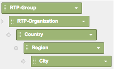

# Rapports RTP personnalisés dans Google Universal Analytics {#custom-rtp-reports-in-google-universal-analytics}

>[!PREREQUISITES]
>
>[Intégration du RTP à Google Universal Analytics](/help/marketo/product-docs/web-personalization/reporting-for-web-personalization/web-analytics-integrations/integrate-rtp-with-google-universal-analytics.md)

Cet article explique comment configurer des rapports personnalisés RTP pour Google Universal Analytics (GUA).  Les données envoyées de RTP vers GUA peuvent être configurées sous la forme de deux rapports personnalisés distincts appelés :

* RTP B2B
* Engagement RTP

## Configuration d’un [!UICONTROL rapport personnalisé] {#setting-up-a-custom-report}

1. Connectez-vous à Google Analytics.

1. Cliquez sur **[!UICONTROL Personnalisation]** dans le menu supérieur.

1. Cliquez sur **[!UICONTROL Nouveau rapport personnalisé]**.

## Rapport RTP B2B {#rtp-b-b-report}

1. Nommez le rapport **RTP B2B Report**.

1. Nommez le 1er onglet **[!UICONTROL Secteur]**.

>[!NOTE]
>
>Vous allez **Dupliquer cet onglet** et créer d’autres onglets similaires - étape 5)

1. Sélectionnez le type de rapport **[!UICONTROL Explorateur]**.

   

1. Dans la section **[!UICONTROL Groupes de mesures]**, sélectionnez les mesures pertinentes pour votre entreprise.

   a. Nous recommandons ce qui suit :

   

1. Dupliquez cet onglet 4 fois et nommez-les :

   1. **Industrie**
   1. **Groupe**
   1. **Catégorie**
   1. **ABM**
   1. **Organisations**

   

1. Dans la section **Analyses Dimension** définissez les dimensions pertinentes pour chaque onglet comme ci-dessous.

<table>
 <thead>
  <tr>
   <th>
    

      Nom de l'onglet
    
</th>
   <th>
    

      Analyses Dimension détaillées
    
</th>
  </tr>
 </thead>
 <tbody>
  <tr>
   <td>Secteur industriel</td>
   <td></td>
  </tr>
  <tr>
   <td>Groupe</td>
   <td></td>
  </tr>
  <tr>
   <td>Catégorie</td>
   <td></td>
  </tr>
  <tr>
   <td>ABM</td>
   <td></td>
  </tr>
  <tr>
   <td>Organisations</td>
   <td></td>
  </tr>
 </tbody>
</table>

1. Ne définissez aucun filtre et définissez ce rapport de sorte qu’il soit disponible pour **[!UICONTROL Toutes les données du site web]** (ou modifiez-le si cela concerne un compte Analytics spécifique).

1. Cliquez sur **[!UICONTROL Enregistrer]**

   

## Rapport d’engagement RTP {#rtp-engagement-report}

1. Nommez le rapport **RTP Engagement Report**.

1. Définissez le nom du 1er onglet sur **[!UICONTROL Tous les engagements]**.

>[!NOTE]
>
>Vous allez dupliquer cet onglet et en créer d’autres similaires (étape 5)

1. Sélectionnez le type de rapport **[!UICONTROL Explorateur]**.

   

1. Dans la section [!UICONTROL Groupes de mesures], sélectionnez les mesures pertinentes pour votre entreprise. Voici une recommandation :

   

1. Dupliquez cet onglet 4 fois et nommez-les :

   1. **Tous les engagements**
   1. **Engagement du secteur**
   1. **Engagement par groupe**
   1. **Engagement par catégorie**
   1. **Engagement par ABM**

   

1. Dans la section **Analyses Dimension** définissez les dimensions pertinentes pour chaque onglet comme ci-dessous :

<table>
 <thead>
  <tr>
   <th>
    

      Nom de l'onglet
    
</th>
   <th>
    

      Analyses Dimension détaillées
    
</th>
  </tr>
 </thead>
 <tbody>
  <tr>
   <td>Tous les engagements</td>
   <td></td>
  </tr>
  <tr>
   <td>Engagement par ABM</td>
   <td></td>
  </tr>
  <tr>
   <td>Engagement par catégorie</td>
   <td></td>
  </tr>
  <tr>
   <td>Engagement par groupe</td>
   <td></td>
  </tr>
  <tr>
   <td>Engagement de l'industrie</td>
   <td></td>
  </tr>
 </tbody>
</table>

1. Définissez les filtres suivants :

<table>
 <thead>
  <tr>
   <th>
    

      Inc/Exc
    
</th>
   <th>
    

      Champ
    
</th>
   <th>
    

      Type de correspondance
    
</th>
   <th>
    

      Valeurs
    
</th>
   <th colspan="1">
    

      Commentaires
    
</th>
  </tr>
 </thead>
 <tbody>
  <tr>
   <td>
Inclure
</td>
   <td>
Catégorie d’événement
</td>
   <td>Regex</td>
   <td>RTP-Campagnes|RTP-Recommendations|RTP-Segments</td>
   <td colspan="1">Filtre tous les autres événements personnalisés qui ne sont pas liés au RTP.</td>
  </tr>
  <tr>
   <td>Exclure</td>
   <td>Libellé de l’événement</td>
   <td>Regex</td>
   <td>#</td>
   <td colspan="1">Permet de filtrer à partir de la campagne de rapports à l’aide de # dans le nom de la campagne</td>
  </tr>
 </tbody>
</table>

1. Définir ce rapport comme étant disponible pour **[!UICONTROL Toutes les données du site Web]** (ou le modifier si nécessaire).

   

1. Cliquez sur **[!UICONTROL Enregistrer]**

>[!MORELIKETHIS]
>
>[Intégration du RTP à Google Universal Analytics](/help/marketo/product-docs/web-personalization/reporting-for-web-personalization/web-analytics-integrations/integrate-rtp-with-google-universal-analytics.md)
>
>[Tableaux de bord RTP personnalisés dans Google Universal Analytics](/help/marketo/product-docs/web-personalization/reporting-for-web-personalization/web-analytics-integrations/custom-rtp-dashboards-in-google-universal-analytics.md)
