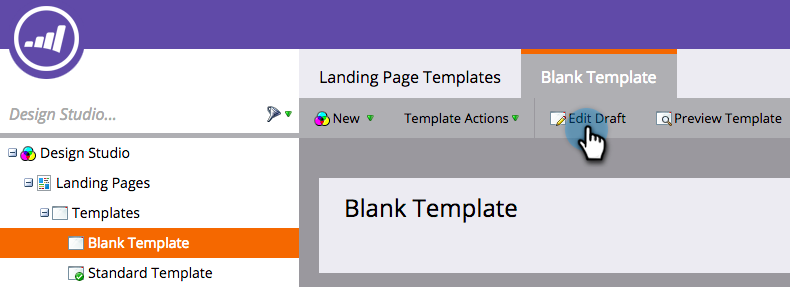

# Mise en œuvre de RTP sur les pages de destination Marketo {#implementing-rtp-on-marketo-landing-pages}

Pour implémenter votre balise [!UICONTROL RTP] suivez les instructions d’installation ci-dessous :

1. Accédez au **[!UICONTROL Design Studio].** Ouvrez l’élément que vous souhaitez modifier. Sélectionnez **[!UICONTROL Actions de modèle]**, puis **[!UICONTROL Modifier le brouillon]**.

   

1. Apportez vos modifications de modèle dans l’onglet **HTML Source**.

   

1. Dans votre compte RTP, accédez à **[!UICONTROL Paramètres du compte]**.

   a. Si vous avez déjà reçu votre balise JavaScript de l’assistance - passez à l’étape 5.

   

1. Sous [!UICONTROL Domaine], recherchez le domaine approprié et cliquez sur **[!UICONTROL Générer la balise]**.

   

   

1. Copiez la balise JavaScript RTP et collez-la dans tous les modèles de page de destination compris entre les balises **`<head> </head>`**.

1. Cliquez sur **[!UICONTROL Enregistrer]** et **[!UICONTROL Fermer]** dans la fenêtre.

1. De retour dans **[!UICONTROL Design Studio]**, approuvez la page de destination à partir de **[!UICONTROL Actions de modèle]**, puis cliquez sur **[!UICONTROL Approuver]**.

   

1. Enfin, vous devrez **réapprouver** toutes les pages de destination utilisant ce modèle pour que les modifications du modèle prennent effet. Vous pouvez toutes les approuver de nouveau en même temps à partir de la section principale [!UICONTROL Pages de destination].

   

1. Vérifiez qu’il apparaît sur toutes les pages, y compris les pages de destination et les sous-domaines.

   Pour ce faire, cliquez avec le bouton droit de la souris sur la page de votre site web. Accédez à **[!UICONTROL Afficher la page Source].** Recherchez **[!UICONTROL RTP]** pour localiser la balise.
