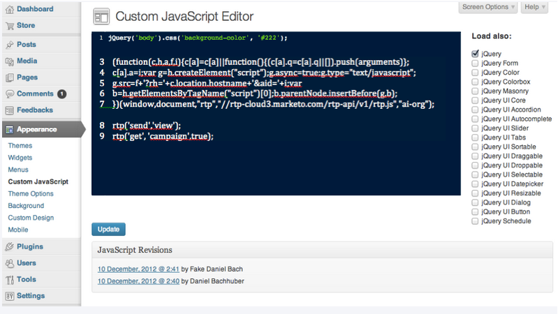

# Implémentation de RTP sur Wordpress Enterprise {#implementing-rtp-on-wordpress-enterprise}

Pour mettre en oeuvre votre balise RTP, suivez les instructions d’installation ci-dessous :

1. Accédez à Paramètres du compte**.**

   1. Si vous avez déjà reçu votre balise JavaScript de l’assistance - passez à l’étape 3.\
      

1. Sous Domaine, recherchez le domaine approprié et cliquez sur **Générer la balise**.

   

1. Copiez la balise JavaScript RTP.
1. Connectez-vous à votre compte WordPress en tant qu’utilisateur administrateur.

   1. Sous **Apparence**, accédez à **JavaScript personnalisé**.
   1. Collez la balise Javascript RTP juste après le code existant.

      
   >[!CAUTION]
   >
   >Lorsque vous collez le code EXCLURE les balises suivantes :
   >
   >* `<!-- RTP tag -->`
   >* ``
   >* `<!-- End of RTP tag -->`

   >    
   >Insérez le script lui-même SEULEMENT.

1. Cliquez sur **Mettre à jour**.
